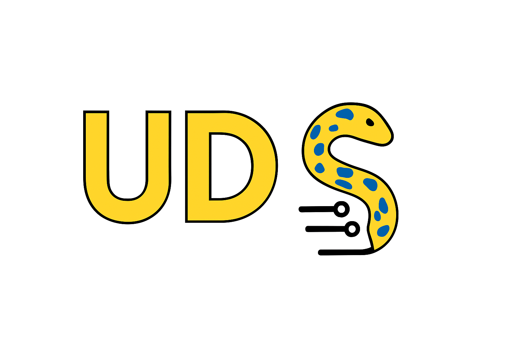

Welcome to UDS documentation!
=============================
.. toctree::
   :maxdepth: 4
   :hidden:

   Home <self>
   pages/installation.rst
   pages/transport.rst
   pages/messages.rst
   pages/client_simulation.rst
   pages/server_simulation.rst
   pages/knowledge_base.rst
   pages/contribution.rst

Overview
--------
The purpose of this project is to provide python tools for simulation (on both sides - client and server) and
monitoring of diagnostic communication defined by ISO-14229. It can be used with any bus type (e.g. CAN, Ethernet, LIN).

The most likely use cases of UDS package are:
 - communication with your vehicle (e.g. reading Diagnostic Trouble Codes)
 - performing tests against on-board ECU (server)
 - performing tests against OBD Tester (client)

License
-------
The project is licensed under the MIT license - https://github.com/mdabrowski1990/uds/blob/main/LICENSE

Contact
-------
- e-mail: uds-package-development@googlegroups.com
- group: `UDS package development <https://groups.google.com/g/uds-package-development/about>`_
- discord: https://discord.gg/XYhJGeBg

.. admonition:: Documentation generated

    |today|
