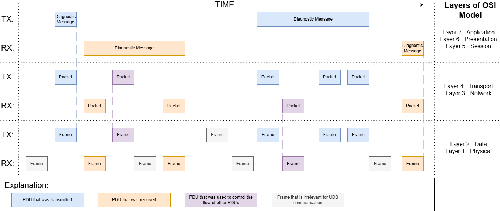

UDS Knowledge Base
==================
If you are not an UDS expert, this part of documentation is created for you. It is meant to provide a technical support
for every user of `UDS package <https://github.com/mdabrowski1990/uds>`_ so you can better understand the code, but also
UDS protocol itself.


UDS OSI Model
-------------
+--------------+--------------------------------+-------------------------------------------+-----------------------------------------------------------------------------+
|   OSI Layer  |          ISO Standards         |              Functionalities              |                                Implementation                               |
+==============+================================+===========================================+=============================================================================+
| Layer 7      | Common:                        | Diagnostic message:                       | - UdsMessage                                                                |
| Application  |                                |                                           |                                                                             |
|              | - ISO 14229-1                  | - creating                                | - UdsMessageRecord                                                          |
|              |                                |                                           |                                                                             |
|              | - ISO 27145-3                  | - storing historic data                   | - RequestSID                                                                |
|              |                                |                                           |                                                                             |
|              |                                | - various SIDs support                    | - ResponseSID                                                               |
|              | CAN specific:                  |                                           |                                                                             |
|              |                                | - bus specific services                   | - NRC                                                                       |
|              | - ISO 14229-3                  |                                           |                                                                             |
|              |                                |                                           | - AddressingType                                                            |
|              |                                |                                           |                                                                             |
|              | FlexRay specific:              |                                           |                                                                             |
|              |                                |                                           | To be extended in milestones:                                               |
|              | - ISO 14229-4                  |                                           |                                                                             |
|              |                                |                                           | - `Database support <https://github.com/mdabrowski1990/uds/milestone/2>`_   |
|              |                                |                                           |                                                                             |
|              | Ethernet specific:             |                                           |                                                                             |
|              |                                |                                           |                                                                             |
|              | - ISO 14229-5                  |                                           |                                                                             |
|              |                                |                                           |                                                                             |
|              |                                |                                           |                                                                             |
|              | K-Line specific:               |                                           |                                                                             |
|              |                                |                                           |                                                                             |
|              | - ISO 14229-6                  |                                           |                                                                             |
|              |                                |                                           |                                                                             |
|              |                                |                                           |                                                                             |
|              | LIN specific:                  |                                           |                                                                             |
|              |                                |                                           |                                                                             |
|              | - ISO 14229-7                  |                                           |                                                                             |
+--------------+--------------------------------+-------------------------------------------+-----------------------------------------------------------------------------+
| Layer 6      | Common:                        | - diagnostic messages data interpretation | To be implemented in milestones:                                            |
| Presentation |                                |                                           |                                                                             |
|              | - ISO 27145-2                  | - messaging database import from a file   | - `Database support <https://github.com/mdabrowski1990/uds/milestone/2>`_   |
|              |                                |                                           |                                                                             |
|              |                                | - messaging database export to a file     |                                                                             |
|              | Unique per system:             |                                           |                                                                             |
|              |                                |                                           |                                                                             |
|              | - system manufacturer specific |                                           |                                                                             |
+--------------+--------------------------------+-------------------------------------------+-----------------------------------------------------------------------------+
| Layer 5      | Common:                        | - Client simulation                       | To be implemented in milestones:                                            |
| Session      |                                |                                           |                                                                             |
|              | - ISO 14229-2                  | - Server simulation                       | - `Client simulation <https://github.com/mdabrowski1990/uds/milestone/8>`_  |
|              |                                |                                           |                                                                             |
|              |                                |                                           | - `Server simulation <https://github.com/mdabrowski1990/uds/milestone/7>`_  |
+--------------+--------------------------------+-------------------------------------------+-----------------------------------------------------------------------------+
| Layer 4      | CAN specific:                  | UDS packets:                              | - AbstractUdsPacket                                                         |
| Transport    |                                |                                           |                                                                             |
|              | - ISO 15765-2                  | - creating                                | - AbstractUdsPacketRecord                                                   |
|              |                                | - storing historic data                   |                                                                             |
|              |                                |                                           | - AbstractPacketType                                                        |
|              | FlexRay specific:              | - support for bus specific packets        |                                                                             |
|              |                                |                                           |                                                                             |
|              | - 10681-2                      |                                           |                                                                             |
|              |                                |                                           |                                                                             |
|              |                                | UDS communication:                        |                                                                             |
|              | Ethernet specific:             |                                           |                                                                             |
+--------------+                                |                                           |                                                                             |
| Layer 3      | - 13400-2                      | - diagnostic messages segmentation        |                                                                             |
| Network      |                                |                                           |                                                                             |
|              |                                | - receiving packets                       |                                                                             |
|              | LIN specific:                  |                                           |                                                                             |
|              |                                | - transmitting packets                    |                                                                             |
|              | - 17987-2                      |                                           |                                                                             |
|              |                                | - errors handling                         |                                                                             |
|              |                                |                                           |                                                                             |
|              |                                | - errors simulation                       |                                                                             |
+--------------+--------------------------------+-------------------------------------------+-----------------------------------------------------------------------------+
| Layer 2      | CAN specific:                  | Bus handling:                             | External python packages for bus handling:                                  |
| Data         |                                |                                           |                                                                             |
|              | - ISO 11898-1                  | - creating frames                         | - `CAN <https://python-can.readthedocs.io>`_                                |
|              |                                |                                           |                                                                             |
|              | - ISO 11898-2                  | - storing historic frames data            |                                                                             |
|              |                                |                                           |                                                                             |
|              | - ISO 11898-3                  | - frames receiving                        |                                                                             |
|              |                                |                                           |                                                                             |
|              |                                | - frames transmitting                     |                                                                             |
|              | FlexRay specific:              |                                           |                                                                             |
|              |                                |                                           |                                                                             |
|              | - ISO 17458-2                  |                                           |                                                                             |
|              |                                |                                           |                                                                             |
|              | - ISO 17458-4                  |                                           |                                                                             |
|              |                                |                                           |                                                                             |
|              |                                |                                           |                                                                             |
+--------------+ Ethernet specific:             |                                           |                                                                             |
| Layer 1      |                                |                                           |                                                                             |
| Physical     | - 13400-3                      |                                           |                                                                             |
|              |                                |                                           |                                                                             |
|              |                                |                                           |                                                                             |
|              | K-Line specific:               |                                           |                                                                             |
|              |                                |                                           |                                                                             |
|              | - ISO 14230-2                  |                                           |                                                                             |
|              |                                |                                           |                                                                             |
|              | - ISO 14230-1                  |                                           |                                                                             |
|              |                                |                                           |                                                                             |
|              |                                |                                           |                                                                             |
|              | LIN specific:                  |                                           |                                                                             |
|              |                                |                                           |                                                                             |
|              | - ISO 17987-3                  |                                           |                                                                             |
|              |                                |                                           |                                                                             |
|              | - ISO 17987-4                  |                                           |                                                                             |
+--------------+--------------------------------+-------------------------------------------+-----------------------------------------------------------------------------+


Client
------
TODO DURING `CLIENT EPIC <https://github.com/mdabrowski1990/uds/milestone/8>`_


Server
------
TODO DURING `SERVER EPIC <https://github.com/mdabrowski1990/uds/milestone/7>`_


Diagnostic Message
------------------
If we only consider the top layer of OSI Model (layer 7 - Application), then the messages that are exchanged by
clients and servers during UDS communication are called 'Application Protocol Data Units' (A_PDU),
'diagnostic messages' or 'UDS messages' in this documentation.

There are two types of diagnostic messages:
 - `diagnostic request`_ - a message transmitted by a client
 - `diagnostic response`_ - a message transmitted by a server


UDS communication is always initiated by a client_ who sends a `diagnostic request`_ to a network that it is connected to.
The client_ might not be directly connected to a desired recipient(s) of the request, therefore some servers might be
forced to act as gateways and transmit the request to another network(s) to which they are connected. Server_ decision
(whether to redirect the request to another vehicle sub-network or not) depends on a target(s) of the request i.e.
server_ shall transmit the request in the sub-network if at least on ECU in this sub-network is the target of
the request.

.. figure:: ../diagrams/KnowledgeBase-Gateway_request.png
    :alt: Gateway - request
    :figclass: align-center

    Diagnostic request routing in example vehicle networks.

    In this example all ECUs in the vehicle are the targets of the request - functionally addressed request was sent.


Each server_ which was the recipient of the request, might decide to send a response back to the nearest client_
(the one which transmitted the request in this sub-network). Then, the client_ shall act as the gateway again and
redirect the response back until it reaches the request message originator (Diagnostic Tester).


    Diagnostic responses routing in example vehicle networks.

    In this example all ECUs in the vehicle responds to the request.


Diagnostic Request
``````````````````
Diagnostic request is a `diagnostic message`_ that was transmitted by a client and targets a server or group of servers.
Diagnostic request can be identified by its `Service Identifier`_ (SID) value.


Diagnostic Response
```````````````````
Diagnostic response is a `diagnostic message`_ that was transmitted by a server and targets a client.
Diagnostic response can be identified by its `Service Identifier`_ (SID) value.

UDS describes two formats of diagnostic responses:
 - `positive response message`_
 - `negative response message`_


Positive Response Message
'''''''''''''''''''''''''
If a server responds with positive response message, it means that the server received the corresponding request
message and executed actions requested by a client.

+------+------------------+------------+
| Byte | Description      | Value      |
+======+==================+============+
| 1    | Response SID     | SID + 0x40 |
+------+------------------+------------+
| 2    | data-parameter#1 | XX         |
+------+------------------+------------+
| ...  | ...              | ...        |
+------+------------------+------------+
| n    | data-parameter#n | XX         |
+------+------------------+------------+

Where:
 - SID - `Service Identifier`_ value that was received in the request message to which the server responded
 - XX - any byte value


Negative Response Message
'''''''''''''''''''''''''
If a server responds with negative response message, it means that the server for some reason the server could not
execute actions requested by a client.

+------+-----------------------+-------+
| Byte | Description           | Value |
+======+=======================+=======+
| 1    | Negative Response SID | 0x7F  |
+------+-----------------------+-------+
| 2    | Request SID           | SID   |
+------+-----------------------+-------+
| 3    | NRC                   | XX    |
+------+-----------------------+-------+

Where:
 - SID - `Service Identifier`_ value that was received in the request message to which the server responded
 - NRC - `Negative Response Code`_ value that identified the reason for negative response


Service Identifier
``````````````````
Service Identifier (SID) is one byte integer located in the first byte of Application Data (A_Data) in the
`diagnostic message`_. SID determines whether the message is `diagnostic request`_ or `diagnostic response`_.
General purpose (application) and format of `diagnostic message`_ is also by determined by SID value.

List of all Service Identifier (SID) values and their application:
 - 0x00 - not applicable, reserved by ISO 14229-1
 - 0x01-0x0F - ISO 15031-5/SAE J1979 specific services
 - 0x10 - `DiagnosticSessionControl`_ service request
 - 0x11 - `ECUReset`_ service request
 - 0x12-0x13 - reserved by ISO 14229-1
 - 0x14 - `ClearDiagnosticInformation`_ service request
 - 0x15-0x18 - reserved by ISO 14229-1
 - 0x19 - `ReadDTCInformation`_ service request
 - 0x1A-0x21 - reserved by ISO 14229-1
 - 0x22 - `ReadDataByIdentifier`_ service request
 - 0x23 - `ReadMemoryByAddress`_ service request
 - 0x24 - `ReadScalingDataByIdentifier`_ service request
 - 0x25-0x26 - reserved by ISO 14229-1
 - 0x27 - `SecurityAccess`_ service request
 - 0x28 - `CommunicationControl`_ service request
 - 0x29 - `Authentication`_ service request
 - 0x2A - `ReadDataByPeriodicIdentifier`_ service request
 - 0x2B - reserved by ISO 14229-1
 - 0x2C - `DynamicallyDefineDataIdentifier`_ service request
 - 0x2D - reserved by ISO 14229-1
 - 0x2E - `WriteDataByIdentifier`_ service request
 - 0x2F - `InputOutputControlByIdentifier`_ service request
 - 0x30 - reserved by ISO 14229-1
 - 0x31 - `RoutineControl`_ service request
 - 0x32-0x33 - reserved by ISO 14229-1
 - 0x34 - `RequestDownload`_ service request
 - 0x35 - `RequestUpload`_ service request
 - 0x36 - `TransferData`_ service request
 - 0x37 - `RequestTransferExit`_ service request
 - 0x38 - `RequestFileTransfer`_ service request
 - 0x39-0x3C - reserved by ISO 14229-1
 - 0x3D - `WriteMemoryByAddress`_ service request
 - 0x3E - `TesterPresent`_ service request
 - 0x3F - not applicable, reserved by ISO 14229-1
 - 0x40 - not applicable, reserved by ISO 14229-1
 - 0x41-0x4F - ISO 15031-5/SAE J1979 specific services
 - 0x50 - positive response to `DiagnosticSessionControl`_ service
 - 0x51 - positive response to `ECUReset`_ service
 - 0x52-0x53 - reserved by ISO 14229-1
 - 0x54 - positive response to `ClearDiagnosticInformation`_ service
 - 0x55-0x58 - reserved by ISO 14229-1
 - 0x59 - positive response to `ReadDTCInformation`_ service
 - 0x5A-0x61 - reserved by ISO 14229-1
 - 0x62 - positive response to `ReadDataByIdentifier`_ service
 - 0x63 - positive response to `ReadMemoryByAddress`_ service
 - 0x64 - positive response to `ReadScalingDataByIdentifier`_ service
 - 0x65-0x66 - reserved by ISO 14229-1
 - 0x67 - positive response to `SecurityAccess`_ service
 - 0x68 - positive response to `CommunicationControl`_ service
 - 0x69 - positive response to `Authentication`_ service
 - 0x6A - positive response to `ReadDataByPeriodicIdentifier`_ service
 - 0x6B - reserved by ISO 14229-1
 - 0x6C - positive response to `DynamicallyDefineDataIdentifier`_ service
 - 0x6D - reserved by ISO 14229-1
 - 0x6E - positive response to `WriteDataByIdentifier`_ service
 - 0x6F - positive response to `InputOutputControlByIdentifier`_ service
 - 0x70 - reserved by ISO 14229-1
 - 0x71 - positive response to `RoutineControl`_ service
 - 0x72-0x73 - reserved by ISO 14229-1
 - 0x74 - positive response to `RequestDownload`_ service
 - 0x75 - positive response to `RequestUpload`_ service
 - 0x76 - positive response to `TransferData`_ service
 - 0x77 - positive response to `RequestTransferExit`_ service
 - 0x78 - positive response to `RequestFileTransfer`_ service
 - 0x79-0x7C - reserved by ISO 14229-1
 - 0x7D - positive response to `WriteMemoryByAddress`_ service
 - 0x7E - positive response to `TesterPresent`_ service
 - 0x7F - negative response service identifier
 - 0x80-0x82 - not applicable, reserved by ISO 14229-1
 - 0x83 - reserved by ISO 14229-1
 - 0x84 - `SecuredDataTransmission`_ service request
 - 0x85 - `ControlDTCSetting`_ service request
 - 0x86 - `ResponseOnEvent`_ service request
 - 0x87 - `LinkControl`_ service request
 - 0x88 - reserved by ISO 14229-1
 - 0x89-0xB9 - not applicable, reserved by ISO 14229-1
 - 0xBA-0xBE - system supplier specific service requests
 - 0xBF-0xC2 - not applicable, reserved by ISO 14229-1
 - 0xC3 - reserved by ISO 14229-1
 - 0xC4 - positive response to `SecuredDataTransmission`_ service
 - 0xC5 - positive response to `ControlDTCSetting`_ service
 - 0xC6 - positive response to `ResponseOnEvent`_ service
 - 0xC7 - positive response to `LinkControl`_ service
 - 0xC8 - reserved by ISO 14229-1
 - 0xC9-0xF9 - not applicable, reserved by ISO 14229-1
 - 0xFA-0xFE - positive responses to system supplier specific requests
 - 0xFF - not applicable, reserved by ISO 14229-1


DiagnosticSessionControl
''''''''''''''''''''''''
DiagnosticSessionControl service is used to change diagnostic sessions in the server(s).
In each diagnostic session a different set of diagnostic services (and/or functionalities) is enabled in the server.
Server shall always be in exactly one diagnostic session.


ECUReset
''''''''
ECUReset service is used by the client to request a server reset.


ClearDiagnosticInformation
''''''''''''''''''''''''''
ClearDiagnosticInformation service is used by the client to clear all diagnostic information (DTC and related data)
in one or multiple servers' memory.


ReadDTCInformation
''''''''''''''''''
ReadDTCInformation service allows the client to read from any server or group of servers within a vehicle,
current information about all Diagnostic Trouble Codes. This could be a status of reported Diagnostic Trouble Code (DTC),
number of currently active DTCs or any other information returned by supported ReadDTCInformation SubFunctions.


ReadDataByIdentifier
''''''''''''''''''''
ReadDataByIdentifier service allows the client to request data record values from the server identifier by one or more
DataIdentifiers (DIDs).


ReadMemoryByAddress
'''''''''''''''''''
ReadMemoryByAddress service allows the client to request server's memory data stored under provided memory address.


ReadScalingDataByIdentifier
'''''''''''''''''''''''''''
ReadScalingDataByIdentifier service allows the client to request from the server a scaling data record identified
by a DataIdentifier (DID). The scaling data contains information such as data record type (e.g. ASCII, signed float),
formula and its coefficients used for value calculation, units, etc.


SecurityAccess
''''''''''''''
SecurityAccess service allows the client to unlock functions/services with restricted access.


CommunicationControl
''''''''''''''''''''
CommunicationControl service allows the client to switch on/off the transmission and/or the reception of certain
messages on a server(s).


Authentication
''''''''''''''
Authentication service provides a means for the client to prove its identity, allowing it to access data and/or
diagnostic services, which have restricted access for, for example security, emissions, or safety reasons.


ReadDataByPeriodicIdentifier
''''''''''''''''''''''''''''
ReadDataByPeriodicIdentifier service allows the client to request the periodic transmission of data record values
from the server identified by one or more periodicDataIdentifiers.


DynamicallyDefineDataIdentifier
'''''''''''''''''''''''''''''''
DynamicallyDefineDataIdentifier service allows the client to dynamically define in a server a DataIdentifier (DID)
that can be read via the ReadDataByIdentifier_ service at a later time.


WriteDataByIdentifier
'''''''''''''''''''''
WriteDataByIdentifier service allows the client to write information into the server at an internal location
specified by the provided DataIdentifier (DID).


InputOutputControlByIdentifier
''''''''''''''''''''''''''''''
InputOutputControlByIdentifier service allows the client to substitute a value for an input signal, internal server
function and/or force control to a value for an output (actuator) of an electronic system.


RoutineControl
''''''''''''''
RoutineControl service allows the client to execute a defined sequence of steps to obtain any relevant result.
There is a lot of flexibility with this service, but typical usage may include functionality such as erasing memory,
resetting or learning adaptive data, running a self-test, overriding the normal server control strategy.


RequestDownload
'''''''''''''''
RequestDownload service allows the client to initiate a data transfer from the client to the server (download).


RequestUpload
'''''''''''''
RequestUpload service allows the client to initiate a data transfer from the server to the client (upload).


TransferData
''''''''''''
TransferData service is used by the client to transfer data either from the client to the server (download) or
from the server to the client (upload).


RequestTransferExit
'''''''''''''''''''
RequestTransferExit service is used by the client to terminate a data transfer between the client and server.


RequestFileTransfer
'''''''''''''''''''
RequestFileTransfer service allows the client to initiate a file data transfer either from the server to
the client (upload) or from the server to the client (upload).


WriteMemoryByAddress
''''''''''''''''''''
WriteMemoryByAddress service allows the client to write information into server's memory data under provided
memory address.


TesterPresent
'''''''''''''
TesterPresent service is used by the client to indicate to a server(s) that the client is still connected to a vehicle
and certain diagnostic services and/or communication that have been previously activated are to remain active.


SecuredDataTransmission
'''''''''''''''''''''''
SecuredDataTransmission service is applicable if a client intends to use diagnostic services defined
in this document in a secured mode. It may also be used to transmit external data, which conform to
some other application protocol, in a secured mode between a client and a server. A secured mode in
this context means that the data transmitted is protected by cryptographic methods.


ControlDTCSetting
'''''''''''''''''
ControlDTCSetting service allows the client to stop or resume the updating of DTC status bits in the server(s) memory.


ResponseOnEvent
'''''''''''''''
ResponseOnEvent service allows the client to request from the server to start ot stop transmission of responses on
a specified event.


LinkControl
'''''''''''
LinkControl service allows the client to control the communication between the client and the server(s) in order to
gain bus bandwidth for diagnostic purposes (e.g. programming).


Negative Response Code
``````````````````````
Negative Response Code (NRC) is one byte value which contains information why a server is not sending
a positive response message.

List of NRC values:
 - 0x00 - positiveResponse - This NRC shall not be used in a negative response message.
   This positiveResponse parameter value is reserved for server internal implementation.
 - 0x00-0x0F - ISO Reserved - This range of values is reserved for future definition by ISO 14229 Standard.
 - 0x10 - generalReject - This NRC indicates that the requested action has been rejected by the server.
 - 0x11 - serviceNotSupported - This NRC indicates that the requested action will not be taken because the
   server does not support the requested service.
 - 0x12 - SubFunctionNotSupported - This NRC indicates that the requested action will not be taken because the
   server does not support the service specific parameters of the request message.
 - 0x13 - incorrectMessageLengthOrInvalidFormat - This NRC indicates that the requested action will not be taken
   because the length of the received request message does not match the prescribed length for the specified service
   or the format of the parameters do not match the prescribed format for the specified service.
 - 0x14 - responseTooLong - This NRC shall be reported by the server if the response to be generated exceeds
   the maximum number of bytes available by the underlying network layer. This could occur if the response message
   exceeds the maximum size allowed by the underlying transport protocol or if the response message exceeds the server
   buffer size allocated for that purpose.
 - 0x15-0x20 - ISO Reserved - This range of values is reserved for future definition by ISO 14229 Standard.
 - 0x21 - busyRepeatRequest - This NRC indicates that the server is temporarily too busy to perform the requested
   operation. In this circumstance the client shall perform repetition of the "identical request message" or
   "another request message". The repetition of the request shall be delayed by a time specified in the respective
   implementation documents.
 - 0x22 - conditionsNotCorrect - This NRC indicates that the requested action will not be taken because the server
   prerequisite conditions are not met.
 - 0x23 - ISO Reserved - This value is reserved for future definition by ISO 14229 Standard.
 - 0x24 - requestSequenceError - This NRC indicates that the requested action will not be taken because the server
   expects a different sequence of request messages or message as sent by the client. This may occur when sequence
   sensitive requests are issued in the wrong order.
 - 0x25 - noResponseFromSubnetComponent - This NRC indicates that the server has received the request but the requested
   action could not be performed by the server as a subnet component which is necessary to supply the requested
   information did not respond within the specified time.
 - 0x26 - FailurePreventsExecutionOfRequestedAction - This NRC indicates that the requested action will not be taken
   because a failure condition, identified by a DTC (with at least one DTC status bit for TestFailed, Pending,
   Confirmed or TestFailedSinceLastClear set to 1), has occurred and that this failure condition prevents the server
   from performing the requested action.
 - 0x27-0x30 - ISO Reserved - This range of values is reserved for future definition by ISO 14229 Standard.
 - 0x31 - requestOutOfRange - This NRC indicates that the requested action will not be taken because the server has
   detected that the request message contains a parameter which attempts to substitute a value beyond its range of
   authority (e.g. attempting to substitute a data byte of 111 when the data is only defined to 100), or which attempts
   to access a DataIdentifier/RoutineIdentifer that is not supported or not supported in active session.
 - 0x32 - ISO Reserved - This value is reserved for future definition by ISO 14229 Standard.
 - 0x33 - securityAccessDenied - This NRC indicates that the requested action will not be taken because the server's
   security strategy has not been satisfied by the client.
 - 0x34 - authenticationRequired - This NRC indicates that the requested service will not be taken because the client
   has insufficient rights based on its Authentication state.
 - 0x35 - invalidKey - This NRC indicates that the server has not given security access because the key sent by
   the client did not match with the key in the server's memory. This counts as an attempt to gain security.
 - 0x36 - exceedNumberOfAttempts - This NRC indicates that the requested action will not be taken because the client
   has unsuccessfully attempted to gain security access more times than the server's security strategy will allow.
 - 0x37 - requiredTimeDelayNotExpired - This NRC indicates that the requested action will not be taken because
   the client's latest attempt to gain security access was initiated before the server's required timeout period had
   elapsed.
 - 0x38 - secureDataTransmissionRequired - This NRC indicates that the requested service will not be taken because
   the requested action is required to be sent using a secured communication channel.
 - 0x39 - secureDataTransmissionNotAllowed - This NRC indicates that this message was received using the
   SecuredDataTransmission (SID 0x84) service. However, the requested action is not allowed to be sent using
   the SecuredDataTransmission (0x84) service.
 - 0x3A - secureDataVerificationFailed - This NRC indicates that the message failed in the security sub-layer.
 - 0x3B-0x4F - ISO Reserved - This range of values is reserved for future definition by ISO 14229 Standard.
 - 0x50 - Certificate verification failed, Invalid Time Period - Date and time of the server does not match
   the validity period of the Certificate.
 - 0x51 - Certificate verification failed, Invalid Signature - Signature of the Certificate could not be verified.
 - 0x52 - Certificate verification failed, Invalid Chain of Trust - Certificate could not be verified against stored
   information about the issuing authority.
 - 0x53 - Certificate verification failed, Invalid Type - Certificate does not match the current requested use
   case.
 - 0x54 - Certificate verification failed, Invalid Format - Certificate could not be evaluated because the format
   requirement has not been met.
 - 0x55 - Certificate verification failed, Invalid Content - Certificate could not be verified because the content
   does not match.
 - 0x56 - Certificate verification failed, Invalid Scope - The scope of the Certificate does not match the contents
   of the server.
 - 0x57 - Certificate verification failed, Invalid Certificate (revoked) - Certificate received from client is invalid,
   because the server has revoked access for some reason.
 - 0x58 - Ownership verification failed - Delivered Ownership does not match the provided challenge or could not
   verified with the own private key.
 - 0x59 - Challenge calculation failed - The challenge could not be calculated on the server side.
 - 0x5A - Setting Access Rights failed - The server could not set the access rights.
 - 0x5B - Session key creation/derivation failed - The server could not create or derive a session key.
 - 0x5C - Configuration data usage failed - The server could not work with the provided configuration data.
 - 0x5D - DeAuthentication failed - DeAuthentication was not successful, server could still be unprotected.
 - 0x5E-0x6F - ISO Reserved - This range of values is reserved for future definition by ISO 14229 Standard.
 - 0x70 - uploadDownloadNotAccepted - This NRC indicates that an attempt to upload/download to a server's memory
   cannot be accomplished due to some fault conditions.
 - 0x71 - transferDataSuspended - This NRC indicates that a data transfer operation was halted due to some fault.
   The active transferData sequence shall be aborted.
 - 0x72 - generalProgrammingFailure - This NRC indicates that the server detected an error when erasing or programming
   a memory location in the permanent memory device (e.g. Flash Memory).
 - 0x73 - wrongBlockSequenceCounter - This NRC indicates that the server detected an error in the sequence of
   blockSequenceCounter values. Note that the repetition of a TransferData request message with a blockSequenceCounter
   equal to the one included in the previous TransferData request message shall be accepted by the server.
 - 0x74-0x77 - ISO Reserved - This range of values is reserved for future definition by ISO 14229 Standard.
 - 0x78 - requestCorrectlyReceived-ResponsePending - This NRC indicates that the request message was received correctly,
   and that all parameters in the request message were valid (these checks can be delayed until after sending this NRC
   if executing the boot software), but the action to be performed is not yet completed and the server is not yet ready
   to receive another request. As soon as the requested service has been completed, the server shall send a positive
   response message or negative response message with a response code different from this.
 - 0x79-0x7D - ISO Reserved - This range of values is reserved for future definition by ISO 14229 Standard.
 - 0x7E - SubFunctionNotSupportedInActiveSession - This NRC indicates that the requested action will not be taken
   because the server does not support the requested SubFunction in the session currently active. This NRC shall only
   be used when the requested SubFunction is known to be supported in another session, otherwise response code
   SubFunctionNotSupported shall be used.
 - 0x7F - serviceNotSupportedInActiveSession - This NRC indicates that the requested action will not be taken because
   the server does not support the requested service in the session currently active. This NRC shall only be used when
   the requested service is known to be supported in another session, otherwise response code serviceNotSupported
   shall be used.
 - 0x80 - ISO Reserved - This value is reserved for future definition by ISO 14229 Standard.
 - 0x81 - rpmTooHigh - This NRC indicates that the requested action will not be taken because the server prerequisite
   condition for RPM is not met (current RPM is above a preprogrammed maximum threshold).
 - 0x82 - rpmTooLow - This NRC indicates that the requested action will not be taken because the server prerequisite
   condition for RPM is not met (current RPM is below a preprogrammed minimum threshold).
 - 0x83 - engineIsRunning - This NRC is required for those actuator tests which cannot be actuated while the Engine
   is running. This is different from RPM too high negative response, and shall be allowed.
 - 0x84 - engineIsNotRunning - This NRC is required for those actuator tests which cannot be actuated unless
   the Engine is running. This is different from RPM too low negative response, and shall be allowed.
 - 0x85 - engineRunTimeTooLow - This NRC indicates that the requested action will not be taken because the server
   prerequisite condition for engine run time is not met (current engine run time is below a preprogrammed limit).
 - 0x86 - temperatureTooHigh - This NRC indicates that the requested action will not be taken because the server
   prerequisite condition for temperature is not met (current temperature is above a preprogrammed maximum threshold).
 - 0x87 - temperatureTooLow - This NRC indicates that the requested action will not be taken because the server
   prerequisite condition for temperature is not met (current temperature is below a preprogrammed minimum threshold).
 - 0x88 - vehicleSpeedTooHigh - This NRC indicates that the requested action will not be taken because the server
   prerequisite condition for vehicle speed is not met (current VS is above a preprogrammed maximum threshold).
 - 0x89 - vehicleSpeedTooLow - This NRC indicates that the requested action will not be taken because the server
   prerequisite condition for vehicle speed is not met (current VS is below a preprogrammed minimum threshold).
 - 0x8A - throttle/PedalTooHigh - This NRC indicates that the requested action will not be taken because the server
   prerequisite condition for throttle/pedal position is not met (current throttle/pedal position is above
   a preprogrammed maximum threshold).
 - 0x8B - throttle/PedalTooLow - This NRC indicates that the requested action will not be taken because the server
   prerequisite condition for throttle/pedal position is not met (current throttle/pedal position is below
   a preprogrammed minimum threshold).
 - 0x8C - transmissionRangeNotInNeutral - This NRC indicates that the requested action will not be taken because
   the server prerequisite condition for being in neutral is not met (current transmission range is not in neutral).
 - 0x8D - transmissionRangeNotInGear - This NRC indicates that the requested action will not be taken because the server
   prerequisite condition for being in gear is not met (current transmission range is not in gear).
 - 0x8E - ISO Reserved - This value is reserved for future definition by ISO 14229 Standard.
 - 0x8F - brakeSwitch(es)NotClosed (Brake Pedal not pressed or not applied) - This NRC indicates that for safety
   reasons, this is required for certain tests before it begins, and shall be maintained for the entire duration of
   the test.
 - 0x90 - shifterLeverNotInPark - This NRC indicates that for safety reasons, this is required for certain tests before
   it begins, and shall be maintained for the entire duration of the test.
 - 0x91 - torqueConverterClutchLocked - This NRC indicates that the requested action will not be taken because
   the server prerequisite condition for torque converter clutch is not met (current torque converter clutch status
   above a preprogrammed limit or locked).
 - 0x92 - voltageTooHigh - This NRC indicates that the requested action will not be taken because the server
   prerequisite condition for voltage at the primary pin of the server (ECU) is not met (current voltage is above
   a preprogrammed maximum threshold).
 - 0x93 - voltageTooLow - This NRC indicates that the requested action will not be taken because the server
   prerequisite condition for voltage at the primary pin of the server (ECU) is not met (current voltage is below
   a preprogrammed maximum threshold).
 - 0x94 - ResourceTemporarilyNotAvailable - This NRC indicates that the server has received the request but
   the requested action could not be performed by the server because an application which is necessary to supply
   the requested information is temporality not available. This NRC is in general supported by each diagnostic service,
   as not otherwise stated in the data link specific implementation document, therefore it is not listed in the list
   of applicable response codes of the diagnostic services.
 - 0x95-0xEF - reservedForSpecificConditionsNotCorrect - This range of values is reserved for future definition
   condition not correct scenarios by ISO 14229 Standard.
 - 0xF0-0xFE - vehicleManufacturerSpecificConditionsNotCorrect - This range of values is reserved for vehicle
   manufacturer specific condition not correct scenarios.
 - 0xFF - ISO Reserved - This value is reserved for future definition by ISO 14229 Standard.


Addressing
``````````
Addressing determines model of UDS communication.

We distinguish following addressing types:
 - Physical_
 - Functional_


Physical
''''''''
Physical addressing is used to send a dedicated message to a certain server (ECU).
When physically addressed messages are sent, the direct (point-to-point) communication between the client and
the server takes place. The server shall respond to physically addressed request unless the request contains
an information that response is not required (further explained in`response behaviour to physically addressed request`_
chapter).

NOTE: You do not need a direct physical connection between the client and the server to have physically addressed
communication as all messages shall be routed to a target of each message.


Response behaviour to physically addressed request
..................................................
Expected server behaviour in case of receiving physically addressed request message with SubFunction parameter:

+----------------------------------+----------------------------------------------------------------+-----------------------------------------------+-------------------------------------------------------------------------------------------------------------+
|        **Client request**        |                      **Server capability**                     |              **Server response**              |                                                 **Comment**                                                 |
+----------------+-----------------+-------------------+------------------+-------------------------+-----------------------+-----------------------+                                                                                                             |
| **Addressing** |    **SPRMIB**   | **SID supported** | **SF supported** | **DataParam supported** |      **Message**      |        **NRC**        |                                                                                                             |
+----------------+-----------------+-------------------+------------------+-------------------------+-----------------------+-----------------------+-------------------------------------------------------------------------------------------------------------+
|    physical    | False (bit = 0) |        YES        |        YES       |        At least 1       |   Positive Response   |          ---          |                          Server supports the requests and sends positive response.                          |
|                |                 |                   |                  +-------------------------+-----------------------+-----------------------+-------------------------------------------------------------------------------------------------------------+
|                |                 |                   |                  |        At least 1       |   Negative Response   |        NRC = XX       | Server sends negative response because an error occurred processing the data parameters of request message. |
|                |                 |                   |                  +-------------------------+                       +-----------------------+-------------------------------------------------------------------------------------------------------------+
|                |                 |                   |                  |           None          |                       |       NRC = ROOR      |                                Servers sends negative response with NRC 0x31.                               |
|                |                 +-------------------+------------------+-------------------------+                       +-----------------------+-------------------------------------------------------------------------------------------------------------+
|                |                 |         NO        |        ---       |           ---           |                       |  NRC = SNS or SNSIAS  |                            Servers sends negative response with NRC 0x11 or 0x7F.                           |
|                |                 +-------------------+------------------+-------------------------+                       +-----------------------+-------------------------------------------------------------------------------------------------------------+
|                |                 |        YES        |        NO        |           ---           |                       | NRC = SFNS or SFNSIAS |                            Servers sends negative response with NRC 0x12 or 0x7E.                           |
|                +-----------------+-------------------+------------------+-------------------------+-----------------------+-----------------------+-------------------------------------------------------------------------------------------------------------+
|                |  True (bit = 1) |        YES        |        YES       |        At least 1       |      No Response      |          ---          |                                       Server does not send a response.                                      |
|                |                 |                   |                  +-------------------------+-----------------------+-----------------------+-------------------------------------------------------------------------------------------------------------+
|                |                 |                   |                  |        At least 1       |   Negative Response   |        NRC = XX       | Server sends negative response because an error occurred processing the data parameters of request message. |
|                |                 |                   |                  +-------------------------+                       +-----------------------+-------------------------------------------------------------------------------------------------------------+
|                |                 |                   |                  |           None          |                       |       NRC = ROOR      |                                Servers sends negative response with NRC 0x31.                               |
|                |                 +-------------------+------------------+-------------------------+                       +-----------------------+-------------------------------------------------------------------------------------------------------------+
|                |                 |         NO        |        ---       |           ---           |                       |  NRC = SNS or SNSIAS  |                            Servers sends negative response with NRC 0x11 or 0x7F.                           |
|                |                 +-------------------+------------------+-------------------------+                       +-----------------------+-------------------------------------------------------------------------------------------------------------+
|                |                 |        YES        |        NO        |           ---           |                       | NRC = SFNS or SFNSIAS |                            Servers sends negative response with NRC 0x12 or 0x7E.                           |
+----------------+-----------------+-------------------+------------------+-------------------------+-----------------------+-----------------------+-------------------------------------------------------------------------------------------------------------+

Expected server behaviour in case of receiving physically addressed request message without SubFunction parameter:

+--------------------+---------------------------------------------+-----------------------------------------+-------------------------------------------------------------------------------------------------------------+
| **Client request** |            **Server capability**            |           **Server response**           |                                                 **Comment**                                                 |
+--------------------+-------------------+-------------------------+-------------------+---------------------+                                                                                                             |
|   **Addressing**   | **SID supported** | **DataParam supported** |    **Message**    |       **NRC**       |                                                                                                             |
+--------------------+-------------------+-------------------------+-------------------+---------------------+-------------------------------------------------------------------------------------------------------------+
|      physical      |        YES        |           All           | Positive Response |         ---         |                          Server supports the requests and sends positive response.                          |
|                    |                   +-------------------------+                   +---------------------+-------------------------------------------------------------------------------------------------------------+
|                    |                   |        At least 1       |                   |         ---         |                          Server supports the requests and sends positive response.                          |
|                    |                   +-------------------------+-------------------+---------------------+-------------------------------------------------------------------------------------------------------------+
|                    |                   |        At least 1       | Negative Response |       NRC = XX      | Server sends negative response because an error occurred processing the data parameters of request message. |
|                    |                   +-------------------------+                   +---------------------+-------------------------------------------------------------------------------------------------------------+
|                    |                   |           None          |                   |      NRC = ROOR     |                                Servers sends negative response with NRC 0x31.                               |
|                    +-------------------+-------------------------+                   +---------------------+-------------------------------------------------------------------------------------------------------------+
|                    |         NO        |           ---           |                   | NRC = SNS or SNSIAS |                            Servers sends negative response with NRC 0x11 or 0x7F                            |
+--------------------+-------------------+-------------------------+-------------------+---------------------+-------------------------------------------------------------------------------------------------------------+

Where:
 - SPRMIB - flag informing whether Suppress Positive Response Message Indication Bit is set in the received request
   message
 - SID supported - flag informing whether Service Identifier in the received request message is supported by the server
 - SF supported - flag informing whether SubFunction in the received request message is supported by the server
 - DataParam supported - information whether values of data parameters (e.g. DIDs, RIDs, DTCStatusMask) in the received
   request message are supported by the server
 - NRC - Negative Response Code
 - ROOR - NRC 0x31 (requestOutOfRange)
 - SNS - NRC 0x11 (serviceNotSupported)
 - SNSIAS - NRC 0x7F (serviceNotSupportedInActiveSession)
 - SFNS - NRC 0x12 (SubFunctionNotSupported)
 - SFNSIAS - NRC 0x7E (SubFunctionNotSupportedInActiveSession)
 - XX - NRC code that is supported by the server and suitable to the current situation (e.g. NRC 0x21 busyRepeatRequest
   if server is currently overloaded and cannot process next request message)


Functional
''''''''''
Functional addressing is used to send messages to multiple servers (ECUs) in the network.
When functionally addressed messages are sent, the one to many communication between the client and
the servers (ECUs) takes place. The server shall only respond to certain requests (further explained in
`response behaviour to functionally addressed request`_ chapter.

NOTE: Some types of buses (e.g. LIN) might also support broadcast communication which is very similar to functionally
addressed. The only difference is that a server response is never expected by the client during broadcast communication.


Response behaviour to functionally addressed request
....................................................
Expected server behaviour in case of receiving functionally addressed request message with SubFunction parameter:

+----------------------------------+----------------------------------------------------------------+------------------------------+-------------------------------------------------------------------------------------------------------------+
|        **Client request**        |                      **Server capability**                     |      **Server response**     |                                                 **Comment**                                                 |
+----------------+-----------------+-------------------+------------------+-------------------------+-------------------+----------+                                                                                                             |
| **Addressing** |    **SPRMIB**   | **SID supported** | **SF supported** | **DataParam supported** |    **Message**    |  **NRC** |                                                                                                             |
+----------------+-----------------+-------------------+------------------+-------------------------+-------------------+----------+-------------------------------------------------------------------------------------------------------------+
|   functional   | False (bit = 0) |        YES        |        YES       |        At least 1       | Positive Response |    ---   |                          Server supports the requests and sends positive response.                          |
|                |                 |                   |                  +-------------------------+-------------------+----------+-------------------------------------------------------------------------------------------------------------+
|                |                 |                   |                  |        At least 1       | Negative Response | NRC = XX | Server sends negative response because an error occurred processing the data parameters of request message. |
|                |                 |                   |                  +-------------------------+-------------------+----------+-------------------------------------------------------------------------------------------------------------+
|                |                 |                   |                  |           None          |    No Response    |    ---   |                                       Server does not send a response.                                      |
|                |                 +-------------------+------------------+-------------------------+                   +----------+-------------------------------------------------------------------------------------------------------------+
|                |                 |         NO        |        ---       |           ---           |                   |    ---   |                                       Server does not send a response.                                      |
|                |                 +-------------------+------------------+-------------------------+                   +----------+-------------------------------------------------------------------------------------------------------------+
|                |                 |        YES        |        NO        |           ---           |                   |    ---   |                                       Server does not send a response.                                      |
|                +-----------------+-------------------+------------------+-------------------------+-------------------+----------+-------------------------------------------------------------------------------------------------------------+
|                |  True (bit = 1) |        YES        |        YES       |        At least 1       |    No Response    |    ---   |                                       Server does not send a response.                                      |
|                |                 |                   |                  +-------------------------+-------------------+----------+-------------------------------------------------------------------------------------------------------------+
|                |                 |                   |                  |        At least 1       | Negative Response | NRC = XX | Server sends negative response because an error occurred processing the data parameters of request message. |
|                |                 |                   |                  +-------------------------+-------------------+----------+-------------------------------------------------------------------------------------------------------------+
|                |                 |                   |                  |           None          |    No Response    |    ---   |                                       Server does not send a response.                                      |
|                |                 +-------------------+------------------+-------------------------+                   +----------+-------------------------------------------------------------------------------------------------------------+
|                |                 |         NO        |        ---       |           ---           |                   |    ---   |                                       Server does not send a response.                                      |
|                |                 +-------------------+------------------+-------------------------+                   +----------+-------------------------------------------------------------------------------------------------------------+
|                |                 |        YES        |        NO        |           ---           |                   |    ---   |                                       Server does not send a response.                                      |
+----------------+-----------------+-------------------+------------------+-------------------------+-------------------+----------+-------------------------------------------------------------------------------------------------------------+

Expected server behaviour in case of receiving functionally addressed request message without SubFunction parameter:

+--------------------+---------------------------------------------+------------------------------+-------------------------------------------------------------------------------------------------------------+
| **Client request** |            **Server capability**            |      **Server response**     |                                                 **Comment**                                                 |
+--------------------+-------------------+-------------------------+-------------------+----------+                                                                                                             |
|   **Addressing**   | **SID supported** | **DataParam supported** |    **Message**    |  **NRC** |                                                                                                             |
+--------------------+-------------------+-------------------------+-------------------+----------+-------------------------------------------------------------------------------------------------------------+
|     functional     |        YES        |           All           | Positive Response |    ---   |                          Server supports the requests and sends positive response.                          |
|                    |                   +-------------------------+                   +----------+-------------------------------------------------------------------------------------------------------------+
|                    |                   |        At least 1       |                   |    ---   |                          Server supports the requests and sends positive response.                          |
|                    |                   +-------------------------+-------------------+----------+-------------------------------------------------------------------------------------------------------------+
|                    |                   |        At least 1       | Negative Response | NRC = XX | Server sends negative response because an error occurred processing the data parameters of request message. |
|                    |                   +-------------------------+-------------------+----------+-------------------------------------------------------------------------------------------------------------+
|                    |                   |           None          |    No Response    |    ---   |                                       Server does not send a response.                                      |
|                    +-------------------+-------------------------+                   +----------+-------------------------------------------------------------------------------------------------------------+
|                    |         NO        |           ---           |                   |    ---   |                                       Server does not send a response.                                      |
+--------------------+-------------------+-------------------------+-------------------+----------+-------------------------------------------------------------------------------------------------------------+

Where:
 - SPRMIB - flag informing whether Suppress Positive Response Message Indication Bit is set in the received request
   message
 - SID supported - flag informing whether Service Identifier in the received request message is supported by the server
 - SF supported - flag informing whether SubFunction in the received request message is supported by the server
 - DataParam supported - information whether values of data parameters (e.g. DIDs, RIDs, DTCStatusMask) in the received
   request message are supported by the server
 - NRC - Negative Response Code
 - XX - NRC code that is supported by the server and suitable to the current situation (e.g. NRC 0x21 busyRepeatRequest
   if server is currently overloaded and cannot process next request message)


Segmentation
````````````
If `diagnostic message`_ data to be transmitted does not fit into a single bus frame, then segmentation process
is required to divide `diagnostic message`_ into smaller pieces called UDS Packets. Each `UDS Packet`_ (or N_PDU)
fits into one frame. To visualize the concept, look on the figure below:



    UDS Protocol Data Units on different layers of OSI Model.


To summarize, we distinguish (in UDS package implementation) following entities that take part in UDS communication on different layers of `UDS OSI Model`_:
 - `Diagnostic message`_ - also called 'Application Protocol Data Unit' (A_PDU)
 - `UDS packet`_ - also called 'Network Protocol Data Unit' (N_PDU). UDS packets types and transmission rules are bus
   specific and always fit into one frame.
 - `Frame <https://en.wikipedia.org/wiki/Frame_(networking)>`_ - the smallest piece of information exchanged by nodes
   in a bus network. Only specific frames take part in UDS communication.

Segmentation process is specific for a bus on which UDS Packets would transmitted.


UDS Packet
``````````
UDS packet is also called Network Protocol Data Unit (N_PDU). It is created during segmentation_ of a
`diagnostic message`_. Each `diagnostic message`_ consists of at least one N_PDU. There are some packets (N_PDUs) which
does not carry any `diagnostic message`_ data as they are used to manage the flow of other packets (N_PDUs).

UDS packet (N_PDU) consists of following fields:
 - `Network Address Information`_ (N_AI) - packet addressing
 - `Network Protocol Control Information`_ (N_PCI) - packet type
 - `Network Data Field`_ (N_Data) - packet date


Network Address Information
'''''''''''''''''''''''''''
Network Address Information (N_AI) contains address information which identifies the recipient(s) and the sender
between whom data exchange takes place. It also describes communication model (e.g. whether response is required)
for the message.


Network Protocol Control Information
''''''''''''''''''''''''''''''''''''
Network Protocol Control Information (N_PCI) identifies the type of `UDS packet`_ (Network Protocol Data Unit).
Supported N_PCIs and theirs values interpretation are bus specific.


Network Data Field
''''''''''''''''''
Network Data Field (N_Data) carries `diagnostic message`_ data. It might be an entire `diagnostic message`_ data (if
`diagnostic message`_ fits into one packet) or just a part (a single packet) of it (if `segmentation`_ had to be
used to divide `diagnostic message`_ into smaller parts).
