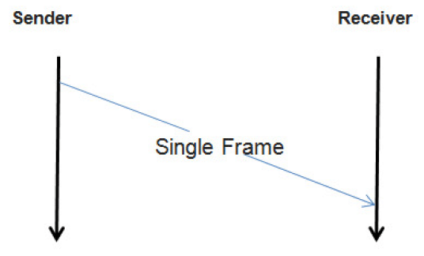

.. _knowledge-base-docan:

Diagnostics over CAN
====================
Diagnostics over CAN (DoCAN) is also called CAN Transport Protocol (CAN ISO TP or CAN-TP). It is an underlying protocol
defined by `ISO 15765 <https://en.wikipedia.org/wiki/ISO_15765>`_ that is used by UDS (but also some other protocols
like SAE J1979 or `KWP2000 <https://en.wikipedia.org/wiki/Keyword_Protocol_2000>`_) for
:ref:`message segmentation <knowledge-base-segmentation>` when communicating over CAN bus.
In other words, UDS (and some other protocols) uses DoCAN as adaptation to CAN networks.
It is presented in :ref:`UDS OSI Model <knowledge-base-osi-model>`.


.. _knowledge-base-can-frame:

CAN Frame
---------
`CAN data frames <https://elearning.vector.com/mod/page/view.php?id=345>`_ are the only type of CAN frames that are used
during DoCAN and therefore UDS communication. CAN data frames consist of many different fields,
but the key in terms of DoCAN communication are listed below:

- CAN Identifier (CAN ID)

  CAN ID is a field that informs every receiving CAN node about a sender and a content of frames.
  CAN nodes shall filter out and ignore CAN frames that are not relevant for them.

  There are two formats of CAN ID:

  - Standard - 11-bit long
  - Extended - 29-bit long

- Data Length Code (DLC)

  Data Length Code (DLC) is a field that informs about number of data bytes that a CAN frame contains.

- CAN Data Field

  CAN Data consists of CAN frame payload bytes. The number of bytes that CAN Data Field contains is determined by
  frame's DLC values as presented in the table:

  +-----+--------------------------+----------------------------+---------------------+
  | DLC | Number of CAN Data bytes | Supported by CLASSICAL CAN | Supported by CAN FD |
  +=====+==========================+============================+=====================+
  | 0x0 |             0            |             YES            |         YES         |
  +-----+--------------------------+----------------------------+---------------------+
  | 0x1 |             1            |             YES            |         YES         |
  +-----+--------------------------+----------------------------+---------------------+
  | 0x2 |             2            |             YES            |         YES         |
  +-----+--------------------------+----------------------------+---------------------+
  | 0x3 |             3            |             YES            |         YES         |
  +-----+--------------------------+----------------------------+---------------------+
  | 0x4 |             4            |             YES            |         YES         |
  +-----+--------------------------+----------------------------+---------------------+
  | 0x5 |             5            |             YES            |         YES         |
  +-----+--------------------------+----------------------------+---------------------+
  | 0x6 |             6            |             YES            |         YES         |
  +-----+--------------------------+----------------------------+---------------------+
  | 0x7 |             7            |             YES            |         YES         |
  +-----+--------------------------+----------------------------+---------------------+
  | 0x8 |             8            |             YES            |         YES         |
  +-----+--------------------------+----------------------------+---------------------+
  | 0x9 |            12            |             NO             |         YES         |
  +-----+--------------------------+----------------------------+---------------------+
  | 0xA |            16            |             NO             |         YES         |
  +-----+--------------------------+----------------------------+---------------------+
  | 0xB |            20            |             NO             |         YES         |
  +-----+--------------------------+----------------------------+---------------------+
  | 0xC |            24            |             NO             |         YES         |
  +-----+--------------------------+----------------------------+---------------------+
  | 0xD |            32            |             NO             |         YES         |
  +-----+--------------------------+----------------------------+---------------------+
  | 0xE |            48            |             NO             |         YES         |
  +-----+--------------------------+----------------------------+---------------------+
  | 0xF |            64            |             NO             |         YES         |
  +-----+--------------------------+----------------------------+---------------------+

.. note:: To learn more about CAN bus and CAN frame structure, we encourage you to read
  `CAN bus specification <http://esd.cs.ucr.edu/webres/can20.pdf>`_ and visit
  `e-learning portal of Vector Informatik GmbH <https://elearning.vector.com/>`_.


.. _knowledge-base-can-packet:

CAN Packet
----------
CAN Packets are :ref:`CAN Frames <knowledge-base-can-frame>` exchanged during DoCAN communication.


.. _knowledge-base-can-data-field:

Data Field
``````````
CAN Packets must have Data Length Code (DLC) equal to 8 (for CLASSICAL CAN and CAN FD) or greater (for CAN FD).
The only exception is usage of `CAN Frame Data Optimization`_.

+-----+------------------------------------------------------------------------+
| DLC |                               Description                              |
+=====+========================================================================+
|  <8 | *Valid only for CAN frames using data optimization*                    |
|     |                                                                        |
|     | Values in this range are only valid for Single Frame, Flow Control and |
|     |                                                                        |
|     | Consecutive Frame that use CAN frame data optimization.                |
+-----+------------------------------------------------------------------------+
|  8  | *Configured CAN frame maximum payload length of 8 bytes*               |
|     |                                                                        |
|     | For the use with CLASSICAL CAN and CAN FD type frames.                 |
+-----+------------------------------------------------------------------------+
| >8  | *Configured CAN frame maximum payload length greater than 8 bytes*     |
|     |                                                                        |
|     | For the use with CAN FD type frames only.                              |
+-----+------------------------------------------------------------------------+

where:

- DLC - Data Length Code of a :ref:`CAN frame <knowledge-base-can-frame>`

.. note:: Number of bytes that carry diagnostic message payload depends on a type and a format of a CAN packet as it is
  presented in :ref:`the table with CAN packets formats <knowledge-base-can-packets-format>`.


.. _knowledge-base-can-frame-data-padding:

CAN Frame Data Padding
''''''''''''''''''''''
If a number of bytes specified in a Packet is shorter than a number of bytes in CAN frame's data field,
then the sender has to pad any unused bytes in the frame. This can only be a case for
:ref:`Single Frame <knowledge-base-can-single-frame>`, :ref:`Flow Control <knowledge-base-can-flow-control>` and
the last :ref:`Consecutive Frame <knowledge-base-can-consecutive-frame>` of a segmented message.
Unless specified differently, the default value 0xCC shall be used for the frame padding to minimize the bit stuffing
insertions and bit alteration on the wire.

.. note:: CAN frame data padding is mandatory for :ref:`CAN frames <knowledge-base-can-frame>` with DLC>8 and
  optional for frames with DLC=8.


.. _knowledge-base-can-data-optimization:

CAN Frame Data Optimization
'''''''''''''''''''''''''''
CAN frame data optimization is an alternative to `CAN Frame Data Padding`_.
If a number of bytes specified in a CAN Packet is shorter than a number of bytes in CAN frame's data field,
then the sender might decrease DLC value of the :ref:`CAN frame <knowledge-base-can-frame>` to the minimal number
that is required to send a desired number of data bytes in a single CAN packet.

.. note:: CAN Frame Data Optimization might always be used for CAN Packets with less than 8 bytes of data to send.

.. warning:: CAN Frame Data Optimization might not always be able to replace `CAN Frame Data Padding`_ when CAN FD
  is used. This is a consequence of DLC values from 9 to 15 meaning as these values are mapped into CAN frame data
  bytes numbers in a non-linear way (e.g. DLC=9 represents 12 data bytes).

  Example:

  *When a CAN Packet with 47 bytes of data is planned for a transmission, then DLC=14 can be used instead of DLC=15,*
  *to choose 48-byte instead of 64-byte long CAN frame. Unfortunately, the last byte of CAN Frame data has to be *
  *padded as there is no way to send over CAN a frame with exactly 47 bytes of data.*


.. _knowledge-base-can-n-pci:

CAN Packet Types
````````````````
According to ISO 15765-2, CAN bus supports 4 types of Packets.

List of all values of :ref:`Network Protocol Control Information <knowledge-base-n-pci>` supported by CAN bus:

- 0x0 - :ref:`Single Frame <knowledge-base-can-single-frame>`
- 0x1 - :ref:`First Frame <knowledge-base-can-first-frame>`
- 0x2 - :ref:`Consecutive Frame <knowledge-base-can-consecutive-frame>`
- 0x3 - :ref:`Flow Control <knowledge-base-can-flow-control>`
- 0x4-0xF - values range reserved for future extension by ISO 15765

The format of all CAN packets is presented in the table below.

.. _knowledge-base-can-packets-format:

+-------------------+---------------------+---------+---------+---------+---------+---------+-----+
|     CAN N_PDU     |       Byte #1       | Byte #2 | Byte #3 | Byte #4 | Byte #5 | Byte #6 | ... |
|                   +----------+----------+         |         |         |         |         |     |
|                   | Bits 7-4 | Bits 3-0 |         |         |         |         |         |     |
+===================+==========+==========+=========+=========+=========+=========+=========+=====+
| Single Frame      | 0x0      | SF_DL    |         |         |         |         |         |     |
|                   |          |          |         |         |         |         |         |     |
| *DLC ≤ 8*         |          |          |         |         |         |         |         |     |
+-------------------+----------+----------+---------+---------+---------+---------+---------+-----+
| Single Frame      | 0x0      | 0x0      | SF_DL   |         |         |         |         |     |
|                   |          |          |         |         |         |         |         |     |
| *DLC > 8*         |          |          |         |         |         |         |         |     |
+-------------------+----------+----------+---------+---------+---------+---------+---------+-----+
| First Frame       | 0x1      |        FF_DL       |         |         |         |         |     |
|                   |          |                    |         |         |         |         |     |
| *FF_DL ≤ 4095*    |          |                    |         |         |         |         |     |
+-------------------+----------+----------+---------+---------+---------+---------+---------+-----+
| First Frame       | 0x1      | 0x0      | 0x00    |                 FF_DL                 |     |
|                   |          |          |         |                                       |     |
| *FF_DL > 4095*    |          |          |         |                                       |     |
+-------------------+----------+----------+---------+---------+---------+---------+---------+-----+
| Consecutive Frame | 0x2      | SN       |         |         |         |         |         |     |
+-------------------+----------+----------+---------+---------+---------+---------+---------+-----+
| Flow Control      | 0x3      | FS       | BS      | ST_min  | N/A     | N/A     | N/A     | N/A |
+-------------------+----------+----------+---------+---------+---------+---------+---------+-----+

where:

- DLC - Data Length Code of a CAN frame, it is equal to number of data bytes carried by this CAN frame
- SF_DL - :ref:`Single Frame Data Length <knowledge-base-can-single-frame-data-length>`
- FF_DL - :ref:`First Frame Data Length <knowledge-base-can-first-frame-data-length>`
- SN - :ref:`Sequence Number <knowledge-base-can-sequence-number>`
- FS - :ref:`Flow Status <knowledge-base-can-flow-status>`
- BS - :ref:`Block Size <knowledge-base-can-block-size>`
- ST_min - :ref:`Separation Time minimum <knowledge-base-can-st-min>`
- N/A - Not Applicable (byte does not carry any information)


.. _knowledge-base-can-single-frame:

Single Frame
''''''''''''
Single Frame (SF) is used by CAN entities to transmit a diagnostic message with a payload short enough to fit it
into a single CAN packet. In other words, Single Frame carries payload of an entire diagnostic message.
Number of payload bytes carried by SF is specified by
:ref:`Single Frame Data Length <knowledge-base-can-single-frame-data-length>` value.


.. _knowledge-base-can-single-frame-data-length:

Single Frame Data Length
........................
Single Frame Data Length (SF_DL) is 4-bit (for CAN packets with DLC<=8) or 8-bit (for CAN packets with DLC>8) value
carried by every Single Frame as presented in
:ref:`the table with CAN packet formats<knowledge-base-can-packets-format>`.
SF_DL specifies number of diagnostic message payload bytes transmitted in a Single Frame.

.. note:: Maximal value of SF_DL depends on Single Frame :ref:`addressing format <knowledge-base-can-addressing>`
  and :ref:`DLC of a CAN message <knowledge-base-can-data-field>` that carries this packet.


.. _knowledge-base-can-first-frame:

First Frame
'''''''''''
First Frame (FF) is used by CAN entities to indicate start of a diagnostic message transmission.
First Frames are only used during a transmission of a segmented diagnostic messages that could not fit into a
:ref:`Single Frame <knowledge-base-can-single-frame>`.
Number of payload bytes carried by FF is specified by
:ref:`First Frame Data Length <knowledge-base-can-first-frame-data-length>` value.


.. _knowledge-base-can-first-frame-data-length:

First Frame Data Length
.......................
First Frame Data Length (FF_DL) is 12-bit (if FF_DL ≤ 4095) or 4-byte (if FF_DL > 4095) value carried by every
First Frame. FF_DL specifies number of diagnostic message payload bytes of a diagnostic message which transmission
was initiated by a First Frame.

.. note:: Maximal value of FF_DL is 4294967295 (0xFFFFFFFF). It means that CAN bus is capable of transmitting
  diagnostic messages that contains up to nearly 4,3 GB of payload.


.. _knowledge-base-can-consecutive-frame:

Consecutive Frame
'''''''''''''''''
Consecutive Frame (CF) is used by CAN entities to continue transmission of a diagnostic message.
:ref:`First Frame <knowledge-base-can-first-frame>` shall always precede (one or more) Consecutive Frames.
Consecutive Frames carry following payload bytes of a diagnostic message that could not fit into
a :ref:`First Frame <knowledge-base-can-first-frame>` that preceded them.
To avoid ambiguity and to make sure that no Consecutive Frame is lost, the order of Consecutive Frames is determined by
:ref:`Sequence Number <knowledge-base-can-sequence-number>` value.


.. _knowledge-base-can-sequence-number:

Sequence Number
...............
Sequence Number (SN) is 4-bit value used to specify the order of Consecutive Frames.

The rules of proper Sequence Number value assignment are following:

- SN value of the first :ref:`Consecutive Frame <knowledge-base-can-consecutive-frame>` that directly follows
  a :ref:`First Frame <knowledge-base-can-first-frame>` shall be set to 1.
- SN shall be incremented by 1 for each following :ref:`Consecutive Frame <knowledge-base-can-consecutive-frame>`.
- SN value shall not be affected by :ref:`Flow Control <knowledge-base-can-flow-control>` packets.
- when SN reaches the value of 15, it shall wraparound and be set to 0 in the next
  :ref:`Consecutive Frame <knowledge-base-can-consecutive-frame>`.


.. _knowledge-base-can-flow-control:

Flow Control
''''''''''''
Flow Control (FC) is used by receiving CAN entities to instruct sending entities to stop, start, pause or resume
transmission of :ref:`Consecutive Frames <knowledge-base-can-consecutive-frame>`.

Flow Control packet contains following parameters:

- :ref:`Flow Status <knowledge-base-can-flow-status>`
- :ref:`Block Size <knowledge-base-can-block-size>`
- :ref:`Separation Time Minimum <knowledge-base-can-st-min>`


.. _knowledge-base-can-flow-status:

Flow Status
...........
Flow Status (FS) is 4-bit value that is used to inform a sending network entity whether it can proceed with
a Consecutive Frames transmission.

Values of Flow Status:

- 0x0 - ContinueToSend (CTS)

  ContinueToSend value of Flow Status informs a sender of a diagnostic message that receiving entity (that responded
  with CTS) is ready to receive a maximum of :ref:`Block Size <knowledge-base-can-block-size>` number of
  :ref:`Consecutive Frames <knowledge-base-can-consecutive-frame>`.

  Reception of a :ref:`Flow Control <knowledge-base-can-flow-control>` packet with ContinueToSend value shall cause
  the sender to resume ConsecutiveFrames sending.

- 0x1 - wait (WAIT)

  Wait value of Flow Status informs a sender of a diagnostic message that receiving entity (that responded with WAIT)
  is not ready to receive another :ref:`Consecutive Frames <knowledge-base-can-consecutive-frame>`.

  Reception of a :ref:`Flow Control <knowledge-base-can-flow-control>` packet with WAIT value shall cause
  the sender to pause ConsecutiveFrames sending and wait for another
  :ref:`Flow Control <knowledge-base-can-flow-control>` packet.

  Values of :ref:`Block Size <knowledge-base-can-block-size>` and :ref:`STmin <knowledge-base-can-st-min>` in
  the :ref:`Flow Control <knowledge-base-can-flow-control>` packet (that contains WAIT value of Flow Status)
  are not relevant and shall be ignored.

- 0x2 - Overflow (OVFLW)

  Overflow value of Flow Status informs a sender of a diagnostic message that receiving entity (that responded
  with OVFLW) is not able to receive a full diagnostic message as it is too big and reception of the message would
  result in `Buffer Overflow <https://en.wikipedia.org/wiki/Buffer_overflow>`_ on receiving side.
  In other words, the value of :ref:`FF_DL <knowledge-base-can-first-frame-data-length>` exceeds the buffer size of
  the receiving entity.

  Reception of a :ref:`Flow Control <knowledge-base-can-flow-control>` packet with Overflow value shall cause
  the sender to abort the transmission of a diagnostic message.

  Overflow value shall only be sent in a :ref:`Flow Control <knowledge-base-can-flow-control>` packet that directly
  follows a :ref:`First Frame <knowledge-base-can-first-frame>`.

  Values of :ref:`Block Size <knowledge-base-can-block-size>` and :ref:`STmin <knowledge-base-can-st-min>` in
  the :ref:`Flow Control <knowledge-base-can-flow-control>` packet (that contains OVFLW value of Flow Status)
  are not relevant and shall be ignored.

- 0x3-0xF - Reserved

  This range of values is reserved for future extension by ISO 15765.


.. _knowledge-base-can-block-size:

Block Size
..........
Block Size (BS) is a one byte value specified by receiving entity that informs about number of
:ref:`Consecutive Frames <knowledge-base-can-consecutive-frame>` to be sent in a one block of packets.

Block Size values:

- 0x00

  The value 0 of the Block Size parameter informs a sender that no more
  :ref:`Flow Control <knowledge-base-can-flow-control>` packets would be sent during the transmission
  of the segmented message.

  Reception of Block Size = 0 shall cause the sender to send all remaining
  :ref:`Consecutive Frames <knowledge-base-can-consecutive-frame>` without any stop for further
  :ref:`Flow Control <knowledge-base-can-flow-control>` packets from the receiving entity.

- 0x01-0xFF

  This range of Block Size values informs a sender the maximum number of
  :ref:`Consecutive Frames <knowledge-base-can-consecutive-frame>` that can be transmitted without an intermediate
  :ref:`Flow Control <knowledge-base-can-flow-control>` packet from the receiving entity.


.. _knowledge-base-can-st-min:

Separation Time Minimum
.......................
Separation Time minimum (STmin) is a one byte value specified by receiving entity that informs about minimum time gap
between the transmission of two following :ref:`Consecutive Frames <knowledge-base-can-consecutive-frame>`.

STmin values:

- 0x00-0x7F - Separation Time minimum range 0-127 ms

  The value of STmin in this range represents the value in milliseconds (ms).

  0x00 = 0 ms

  0xFF = 127 ms

- 0x80-0xF0 - Reserved

  This range of values is reserved for future extension by ISO 15765.

- 0xF1-0xF9 - Separation Time minimum range 100-900 μs

  The value of STmin in this range represents the value in microseconds (μs) according to the formula:

  .. code-block::

    (STmin - 0xF0) * 100 μs

  Meaning of example values:

  0xF1 -> 100 μs

  0xF5 -> 500 μs

  0xF9 -> 900 μs

- 0xFA-0xFF - Reserved

  This range of values is reserved for future extension by ISO 15765.


.. _knowledge-base-can-addressing:

CAN Addressing Formats
----------------------
CAN Addressing Formats define a way of storing :ref:`Network Address Information <knowledge-base-n-ai>` in
`CAN Packet`_.

ISO 15765 defines following 3 addressing formats:

- :ref:`Normal addressing <knowledge-base-can-normal-addressing>`
- :ref:`Extended addressing <knowledge-base-can-extended-addressing>`
- :ref:`Mixed addressing <knowledge-base-can-mixed-addressing>`

.. note:: Regardless of addressing format used, to transmit
  a :ref:`functionally addressed <knowledge-base-functional-addressing>` message over CAN, a sender is allowed to use
  :ref:`Single Frame <knowledge-base-can-single-frame>` packets only.

.. seealso:: `ISO 15765-4 <https://www.iso.org/standard/78384.html>`_ contains detailed information about
  CAN addressing formats.


.. _knowledge-base-can-normal-addressing:

Normal Addressing
`````````````````
Normal CAN Addressing Format is usually used when direct communication with servers is possible -
a client (Diagnostic Tester) is connected to the same CAN network as targeted servers (ECUs).

When Normal CAN Addressing Format is used, then the value of CAN Identifier carries the entire
:ref:`Network Address Information <knowledge-base-n-ai>`. This means that basing solely on CAN Identifier value,
it is possible to identify :ref:`an addressing type <knowledge-base-addressing>`, a transmitting and receiving entities
of a diagnostic packet/message.

.. note:: With normal addressing, both 11-bit (standard) and 29-bit (extended) CAN Identifiers are allowed.

Following parameters contain :ref:`Network Address Information <knowledge-base-n-ai>` for
Normal CAN Addressing Format:

- CAN ID - informs about addressing type, transmitting and receiving nodes

ISO 15765-4 recommends to use following CAN Identifiers for Normal Addressing:

- 0x7DF - functionally addressed request message
- 0x7E0 - physical request to Engine Control Module
- 0x7E8 - physical response from Engine Control Module
- 0x7E1 - physical request to Transmission Control Module
- 0x7E9 - physical response from Transmission Control Module
- 0x7E2 -  physical request to ECU#3
- 0x7EA - physical response from ECU#3
- 0x7E3 -  physical request to ECU#4
- 0x7EB - physical response from ECU#4
- 0x7E4 -  physical request to ECU#5
- 0x7EC - physical response from ECU#5
- 0x7E5 -  physical request to ECU#6
- 0x7ED - physical response from ECU#6
- 0x7E6 -  physical request to ECU#7
- 0x7EE - physical response from ECU#7
- 0x7E7 -  physical request to ECU#8
- 0x7EF - physical response from ECU#8

.. note:: Interpretation of CAN Identifier values is left open for a network designer unless
  `Normal Fixed Addressing`_ sub-format is used.

.. note:: :ref:`Network Protocol Control Information <knowledge-base-n-pci>` is placed in the **first byte** of
  :ref:`CAN frame data field <knowledge-base-can-data-field>` when Normal CAN Addressing format is used.


.. _knowledge-base-can-normal-fixed-addressing:

Normal Fixed Addressing
'''''''''''''''''''''''
Normal Fixed CAN Addressing Format is a special case of `Normal Addressing`_ in which the mapping of
:ref:`Network Address Information <knowledge-base-n-ai>` into the CAN identifier is further specified.

.. note:: With normal fixed addressing, only 29-bit (extended) CAN Identifiers are allowed.

Following parameters contain :ref:`Network Address Information <knowledge-base-n-ai>` for
Normal Fixed CAN Addressing Format:

- CAN ID (with embedded **Target Address** and **Source Address**) - informs about addressing type,
  transmitting and receiving nodes
  - **Source Address** informs about transmitting node
  - **Target Address** informs about receiving node

CAN Identifier values used for UDS communication using normal fixed addressing:

- For :ref:`physical addressed <knowledge-base-physical-addressing>` messages, CAN Identifier value is defined
  as presented below:

  +----------------+----------+--------------+-----------+---------------+---------+---------+---------------+
  |                | Priority | Reserved Bit | Data Page | Protocol data | Target  | Source  | Data          |
  |                |          |              |           | unit format   | Address | Address |               |
  +================+==========+==============+===========+===============+=========+=========+===============+
  | Bits number    |     3    |       1      |     1     |       8       |    8    |    8    |     16-512    |
  +----------------+----------+--------------+-----------+---------------+---------+---------+---------------+
  | Content        |   0 - 7  |       0      |     0     |      218      |   N_TA  |   N_SA  | N_PCI, N_Data |
  +----------------+----------+--------------+-----------+---------------+---------+---------+---------------+
  | CAN field      |                              CAN Identifier                             |    CAN Data   |
  +----------------+----------+--------------+-----------+---------------+---------+---------+---------------+
  | CAN ID bits    |   28-26  |      25      |     24    |     23-16     |   15-8  |   7-0   |      ---      |
  +----------------+----------+--------------+-----------+---------------+---------+---------+---------------+
  | CAN data bytes |    ---   |      ---     |    ---    |      ---      |   ---   |   ---   |      1-64     |
  +----------------+----------+--------------+-----------+---------------+---------+---------+---------------+

  .. code-block::

    # assuming priority parameter equals 0
    CAN_ID = 0xDATTSS

    # assuming priority parameter equals 6 (default value)
    CAN_ID = 0x18DATTSS

    # assuming priority parameter equals 7
    CAN_ID = 0x1CDATTSS


- For :ref:`functional addressed <knowledge-base-functional-addressing>` messages, CAN Identifier value is defined
  as presented below:

  +----------------+----------+--------------+-----------+---------------+---------+---------+---------------+
  |                | Priority | Reserved Bit | Data Page | Protocol data | Target  | Source  | Data          |
  |                |          |              |           | unit format   | Address | Address |               |
  +================+==========+==============+===========+===============+=========+=========+===============+
  | Bits number    |     3    |       1      |     1     |       8       |    8    |    8    |     16-512    |
  +----------------+----------+--------------+-----------+---------------+---------+---------+---------------+
  | Content        |   0 - 7  |       0      |     0     |      219      |   N_TA  |   N_SA  | N_PCI, N_Data |
  +----------------+----------+--------------+-----------+---------------+---------+---------+---------------+
  | CAN field      |                              CAN Identifier                             |    CAN Data   |
  +----------------+----------+--------------+-----------+---------------+---------+---------+---------------+
  | CAN ID bits    |   28-26  |      25      |     24    |     23-16     |   15-8  |   7-0   |      ---      |
  +----------------+----------+--------------+-----------+---------------+---------+---------+---------------+
  | CAN data bytes |    ---   |      ---     |    ---    |      ---      |   ---   |   ---   |      1-64     |
  +----------------+----------+--------------+-----------+---------------+---------+---------+---------------+

  .. code-block::

    # assuming priority parameter equals 0
    CAN_ID = 0xDBTTSS

    # assuming priority parameter equals 6 (default value)
    CAN_ID = 0x18DBTTSS

    # assuming priority parameter equals 7
    CAN_ID = 0x1CDBTTSS

where:

- CAN_ID - value of **CAN Identifier**
- TT - two (hexadecimal) digits of a 8-bit **Target Address** value
- SS - two (hexadecimal) digits of a 8-bit **Source Address** value
- N_TA - Network **Target Address** parameter
- N_SA - Network **Source Address** parameter
- :ref:`N_PCI <knowledge-base-n-pci>` - Network Protocol Control Information
- :ref:`N_Data <knowledge-base-n-data>` - Network Data Field

ISO 15765-4 recommends to use following parameters for Normal Fixed Addressing:

- N_TA = 0xF1 and N_SA = 0xF1 - diagnostic tester parameters
- CAN ID = 0x18DB33F1 (N_TA=0x33, N_SA=0xF1) - functionally addressed request message
- CAN ID = 0x18DA??F1 (replace ?? with ECU's target address) - physically addressed request messages
- CAN ID = 0x18DAF1?? (replace ?? with ECU's source address) - physically addressed response messages


.. _knowledge-base-can-extended-addressing:

Extended Addressing
```````````````````
Extended CAN Addressing Format is usually used when direct communication with servers is not possible -
a client (Diagnostic Tester) is not connected to the same CAN network as server(s), therefore one or more ECU Gateways
are used to pass on the packets/messages.

When Extended CAN Addressing Format is used, then the value of **the first CAN frame byte informs about a target** of
a packet and remaining :ref:`Network Address Information <knowledge-base-n-ai>` (a transmitting entity and
:ref:`an addressing type <knowledge-base-addressing>`) are determined by CAN Identifier value.

.. note:: With extended addressing, both 11-bit (standard) and 29-bit (extended) CAN Identifiers are allowed.

Following parameters specifies :ref:`Network Address Information <knowledge-base-n-ai>` for
Extended CAN Addressing Format:

- CAN ID - informs about addressing type and transmitting node
- Target Address (located in the first data byte of a :ref:`CAN Frame <knowledge-base-can-frame>`) - informs about
  a receiving node

.. note:: :ref:`Network Protocol Control Information <knowledge-base-n-pci>` is placed in the **second byte** of
  :ref:`CAN frame data field <knowledge-base-can-data-field>` when Extended CAN Addressing format is used.


.. _knowledge-base-can-mixed-addressing:

Mixed Addressing
````````````````
Mixed CAN Addressing Format (just like Extended CAN Addressing Format) is used when direct communication with servers
is not possible - a client (Diagnostic Tester) is not connected to the same CAN network as server(s),
therefore one or more ECU Gateways are used to pass on the packets/messages.

When Mixed CAN Addressing Format is used, then the value of **the first byte of a CAN frame is an address extension** of
:ref:`Network Address Information <knowledge-base-n-ai>`.
**The balue of the address extension shall be the same for each for transmitted and received packets.**

.. note:: :ref:`Network Protocol Control Information <knowledge-base-n-pci>` is placed in the **second byte** of
  :ref:`CAN frame data field <knowledge-base-can-data-field>` if mixed addressing format is used.

Following parameters specify :ref:`Network Address Information <knowledge-base-n-ai>` for
Extended CAN Addressing Format:

- CAN ID - informs about addressing type, transmitting and receiving nodes within the network
- Addressing Extension (located in the first data byte of a :ref:`CAN Frame <knowledge-base-can-frame>`) - extends
  information carried by CAN Identifier

Mixed CAN Addressing Format has two sub-types, depending which CAN ID format is used:

- `Mixed Addressing - 11-bit CAN Identifier`_
- `Mixed Addressing - 29-bit CAN Identifier`_


.. _knowledge-base-can-mixed-11-bit-addressing:

Mixed Addressing - 11-bit CAN Identifier
''''''''''''''''''''''''''''''''''''''''
It is a subtype `Mixed Addressing`_ when only 11-bit (standard) CAN Identifiers are used.


.. _knowledge-base-can-mixed-29-bit-addressing:

Mixed Addressing - 29-bit CAN Identifier
''''''''''''''''''''''''''''''''''''''''
It is a subtype `Mixed Addressing`_ when only 29-bit (extended) CAN Identifiers are used.
The mapping of :ref:`Network Address Information <knowledge-base-n-ai>` into the CAN identifier is further specified.

CAN Identifier values used for UDS communication using mixed 29-bit addressing:

- For :ref:`physical addressed <knowledge-base-physical-addressing>` messages, CAN Identifier value is defined
  as presented below:

  +----------------+----------+--------------+-----------+---------------+---------+---------+----------------------+
  |                | Priority | Reserved Bit | Data Page | Protocol data | Target  | Source  | Data                 |
  |                |          |              |           | unit format   | Address | Address |                      |
  +================+==========+==============+===========+===============+=========+=========+======+===============+
  | Bits number    |     3    |       1      |     1     |       8       |    8    |    8    |   8  |     16-504    |
  +----------------+----------+--------------+-----------+---------------+---------+---------+------+---------------+
  | Content        |   0 - 7  |       0      |     0     |      206      |   N_TA  |   N_SA  | N_AE | N_PCI, N_Data |
  +----------------+----------+--------------+-----------+---------------+---------+---------+------+---------------+
  | CAN field      |                              CAN Identifier                             |       CAN Data       |
  +----------------+----------+--------------+-----------+---------------+---------+---------+------+---------------+
  | CAN ID bits    |   28-26  |      25      |     24    |     23-16     |   15-8  |   7-0   |  --- |      ---      |
  +----------------+----------+--------------+-----------+---------------+---------+---------+------+---------------+
  | CAN data bytes |    ---   |      ---     |    ---    |      ---      |   ---   |   ---   |   1  |      2-64     |
  +----------------+----------+--------------+-----------+---------------+---------+---------+------+---------------+

  .. code-block::

    # assuming priority parameter equals 0
    CAN_ID = 0xCETTSS

    # assuming priority parameter equals 6 (default value)
    CAN_ID = 0x18CETTSS

    # assuming priority parameter equals 7
    CAN_ID = 0x1CCETTSS

- For :ref:`functional addressed <knowledge-base-functional-addressing>` messages, CAN Identifier value is defined
  as presented below:

  +----------------+----------+--------------+-----------+---------------+---------+---------+----------------------+
  |                | Priority | Reserved Bit | Data Page | Protocol data | Target  | Source  | Data                 |
  |                |          |              |           | unit format   | Address | Address |                      |
  +================+==========+==============+===========+===============+=========+=========+======+===============+
  | Bits number    |     3    |       1      |     1     |       8       |    8    |    8    |   8  |     16-504    |
  +----------------+----------+--------------+-----------+---------------+---------+---------+------+---------------+
  | Content        |   0 - 7  |       0      |     0     |      205      |   N_TA  |   N_SA  | N_AE | N_PCI, N_Data |
  +----------------+----------+--------------+-----------+---------------+---------+---------+------+---------------+
  | CAN field      |                              CAN Identifier                             |       CAN Data       |
  +----------------+----------+--------------+-----------+---------------+---------+---------+------+---------------+
  | CAN ID bits    |   28-26  |      25      |     24    |     23-16     |   15-8  |   7-0   |  --- |      ---      |
  +----------------+----------+--------------+-----------+---------------+---------+---------+------+---------------+
  | CAN data bytes |    ---   |      ---     |    ---    |      ---      |   ---   |   ---   |   1  |      2-64     |
  +----------------+----------+--------------+-----------+---------------+---------+---------+------+---------------+

  .. code-block::

    # assuming priority parameter equals 0
    CAN_ID = 0xCDTTSS

    # assuming priority parameter equals 6 (default value)
    CAN_ID = 0x18CDTTSS

    # assuming priority parameter equals 7
    CAN_ID = 0x1CCDTTSS

where:

- CAN_ID - value of **CAN Identifier**
- TT - two (hexadecimal) digits of a 8-bit **Target Address** value
- SS - two (hexadecimal) digits of a 8-bit **Source Address** value
- N_TA - Network **Target Address** parameter
- N_SA - Network **Source Address** parameter
- N_AE - Network **Addressing Extension** parameter
- :ref:`N_PCI <knowledge-base-n-pci>` - Network Protocol Control Information
- :ref:`N_Data <knowledge-base-n-data>` - Network Data Field


.. _knowledge-base-can-segmentation:

Segmentation on CAN
-------------------
Segmentation rules that are specific for CAN and DoCAN are described in this chapter.


.. _knowledge-base-can-unsegmented-message-transmission:

Unsegmented message transmission
````````````````````````````````
When mentioning unsegmented message transmission, we mean a case when an entire
:ref:`Diagnostic Message <knowledge-base-diagnostic-message>` can be fully transmitted in a single packet.
:ref:`Single Frame (CAN Packet) <knowledge-base-can-single-frame>` is the type of CAN Packet that shall be used in
this scenario.



  Transmission of an unsegmented Diagnostic Message on CAN bus.

  A sender transmits a :ref:`Single Frame (CAN Packet) <knowledge-base-can-single-frame>` that contains
  an entire :ref:`Diagnostic Message <knowledge-base-diagnostic-message>`.


.. _knowledge-base-can-segmented-message-transmission:

Segmented message transmission
``````````````````````````````
When a :ref:`Diagnostic Message <knowledge-base-diagnostic-message>` to be transmitted on CAN, contains payload which
size is greater than a :ref:`Single Frame <knowledge-base-can-single-frame>` capacity, then the message payload
must be divided and transmitted by many :ref:`CAN packets <knowledge-base-can-packet>`.
The first packet to carry such messages is :ref:`First Frame (CAN Packet) <knowledge-base-can-first-frame>`
and its transmission is followed by :ref:`Consecutive Frames (CAN Packets) <knowledge-base-can-consecutive-frame>`.
A receiver controls the stream of incoming :ref:`Consecutive Frames <knowledge-base-can-consecutive-frame>`
by sending :ref:`Flow Control (CAN Packet) <knowledge-base-can-flow-control>` after
:ref:`First Frame <knowledge-base-can-first-frame>` and each complete transmission of
:ref:`Consecutive Frames <knowledge-base-can-consecutive-frame>` block.

.. note:: The size of :ref:`Consecutive Frames <knowledge-base-can-consecutive-frame>` block is determined by
  :ref:`Block Size <knowledge-base-can-block-size>` parameter provided in
  :ref:`Flow Control <knowledge-base-can-flow-control>`.

.. note:: The minimum time between two :ref:`Consecutive Frames <knowledge-base-can-consecutive-frame>` is determined by
  :ref:`Separation Time Minimum <knowledge-base-can-st-min>` parameter provided in
  :ref:`Flow Control <knowledge-base-can-flow-control>`.


.. figure:: ../../images/CAN_Segmented_Message.png
  :alt: Segmented Message on CAN
  :figclass: align-center
  :width: 100%

  Transmission of a segmented Diagnostic Message on CAN bus.

  A sender initiates :ref:`Diagnostic Message <knowledge-base-diagnostic-message>` transmission with
  a :ref:`First Frame (CAN Packet) <knowledge-base-can-first-frame>`
  Then, a receiver controls the stream of incoming
  :ref:`Consecutive Frames (CAN Packets) <knowledge-base-can-consecutive-frame>`
  by transmitting :ref:`Flow Controls (CAN Packets) <knowledge-base-can-flow-control>`.

.. seealso:: Only the typical use case of :ref:`Flow Control <knowledge-base-can-flow-control>` was described here.
  Check :ref:`Flow Status <knowledge-base-can-flow-status>` parameter and meaning of its values to learn about other
  use cases.


.. _knowledge-base-can-performance-and-error-handling:

Performance and Error Handling
------------------------------
:ref:`ISO standards <knowledge-base-uds-standards>` defines following time parameters Diagnostic on CAN communication:

- N_As_
- N_Ar_
- N_Bs_
- N_Br_
- N_Cs_
- N_Cr_

.. figure:: ../../images/CAN_Timings.png
    :alt: Diagnostic on CAN timings
    :figclass: align-center
    :width: 100%

    Network layer time values (N_As, N_Ar, N_Bs, N_Br, N_Cs, N_Cr) present during UDS on CAN communication.

.. note:: The example uses
    :ref:`segmented diagnostic message transmission <knowledge-base-can-segmented-message-transmission>`
    as it enables to present all CAN timing parameters.
    For :ref:`unsegmented diagnostic message transmission <knowledge-base-can-unsegmented-message-transmission>` though,
    the only applicable time parameter is N_As_.


.. _knowledge-base-can-n-as:

N_As
````
N_As is a time parameter related to transmission of any :ref:`CAN Packet <knowledge-base-can-packet>` by a sender.
It is measured from the beginning of the :ref:`CAN Frame <knowledge-base-can-frame>` (that carries such CAN Packet)
transmission till the reception of a confirmation that this CAN Frame was received by a receiver.

Timeout value:
  1000 ms

Error handling:
  If N_As timeout is exceeded, then the transmission of
  the :ref:`diagnostic message <knowledge-base-diagnostic-message>` shall be aborted.

Affected :ref:`CAN Packets <knowledge-base-can-packet>`:
  - :ref:`Single Frame <knowledge-base-can-single-frame>`
  - :ref:`First Frame <knowledge-base-can-first-frame>`
  - :ref:`Consecutive Frame <knowledge-base-can-consecutive-frame>`


.. _knowledge-base-can-n-ar:

N_Ar
````
N_Ar is a time parameter related to transmission of any :ref:`CAN Packet <knowledge-base-can-packet>` by a receiver.
It is measured from the beginning of the :ref:`CAN Frame <knowledge-base-can-frame>` (that carries such CAN Packet)
transmission till the reception of a confirmation that this CAN Frame was received by a sender.

Timeout value:
  1000 ms

Error handling:
  If N_Ar timeout is exceeded, then the reception of the :ref:`diagnostic message <knowledge-base-diagnostic-message>`
  shall be aborted.

Affected :ref:`CAN Packets <knowledge-base-can-packet>`:
  - :ref:`Flow Control <knowledge-base-can-flow-control>`


.. _knowledge-base-can-n-bs:

N_Bs
````
N_Bs is a time parameter related to :ref:`Flow Control (CAN Packet) <knowledge-base-can-flow-control>` reception
by a sender. It is measured from the end of the last CAN Packet transmission (either transmitted
:ref:`First Frame <knowledge-base-can-first-frame>`, :ref:`Consecutive Frame <knowledge-base-can-consecutive-frame>`
or received :ref:`Flow Control <knowledge-base-can-flow-control>`), till the reception of
:ref:`Flow Control <knowledge-base-can-flow-control>`.

Timeout value:
  1000 ms

Error handling:
  If N_Bs timeout is exceeded, then the reception of the :ref:`diagnostic message <knowledge-base-diagnostic-message>`
  shall be aborted.

Affected :ref:`CAN Packets <knowledge-base-can-packet>`:
  - :ref:`Flow Control <knowledge-base-can-flow-control>`


.. _knowledge-base-can-n-br:

N_Br
````
N_Br is a time parameter related to :ref:`Flow Control (CAN Packet) <knowledge-base-can-flow-control>` transmission
by a receiver. It is measured from the end of the last CAN Packet transmission (either received
:ref:`First Frame <knowledge-base-can-first-frame>`, :ref:`Consecutive Frame <knowledge-base-can-consecutive-frame>`
or transmitted :ref:`Flow Control <knowledge-base-can-flow-control>`), till the start of
:ref:`Flow Control <knowledge-base-can-flow-control>` transmission.

Performance requirement:
  A receiving entity is obliged to transmit :ref:`Flow Control <knowledge-base-can-flow-control>` packet before value
  of N_Br achieves maximal value threshold.

  .. code-block::

    [N_Br] + [N_Ar] < 0.9 * [N_Bs timeout]
    [N_Br max] = 900ms - [N_Ar]

Affected :ref:`CAN Packets <knowledge-base-can-packet>`:
  - :ref:`Flow Control <knowledge-base-can-flow-control>`


.. _knowledge-base-can-n-cs:

N_Cs
````
N_Cs is a time parameter related to :ref:`Consecutive Frame (CAN Packet) <knowledge-base-can-consecutive-frame>`
transmission by a sender. It is measured from the end of the last CAN Packet transmission (either received
:ref:`Flow Control <knowledge-base-can-flow-control>` or transmitted
:ref:`Consecutive Frame <knowledge-base-can-consecutive-frame>`), till the start of
:ref:`Consecutive Frame <knowledge-base-can-consecutive-frame>` transmission.

Performance requirement:
  A sending entity is obliged to transmit :ref:`Consecutive Frame <knowledge-base-can-consecutive-frame>` packet
  before value of N_Cs achieves maximal value threshold.

  .. code-block::

    [N_Cs] + [N_As] < 0.9 * [N_Cr timeout]
    [N_Cs max] = 900ms - [N_As]

Affected :ref:`CAN Packets <knowledge-base-can-packet>`:
  - :ref:`Consecutive Frame <knowledge-base-can-consecutive-frame>`


.. _knowledge-base-can-n-cr:

N_Cr
````
N_Cr is a time parameter related to :ref:`Consecutive Frame (CAN Packet) <knowledge-base-can-consecutive-frame>`
reception by a receiver. It is measured from the end of the last CAN Packet transmission (either transmitted
:ref:`Flow Control <knowledge-base-can-flow-control>` or received
:ref:`Consecutive Frame <knowledge-base-can-consecutive-frame>`), till the reception of
:ref:`Consecutive Frame <knowledge-base-can-consecutive-frame>`.

Timeout value:
  1000 ms

Error handling:
  If N_Cr timeout is exceeded, then the reception of the :ref:`diagnostic message <knowledge-base-diagnostic-message>`
  shall be aborted.

Affected :ref:`CAN Packets <knowledge-base-can-packet>`:
  - :ref:`Consecutive Frame <knowledge-base-can-consecutive-frame>`


.. _knowledge-base-can-unexpected-packet-arrival:

Unexpected Packet handling
``````````````````````````
According to ISO 15765-2:2016:
    As a general rule, arrival of an unexpected N_PDU from any node shall be ignored, with the exception of SF N_PDUs
    and physically addressed FF N_PDUs; functionally addressed FirstFrames shall be ignored.
    When the specified action is to ignore an unexpected N_PDU, this means that the network layer shall not notify
    the upper layers of its arrival.

    Depending on the network layer design decision to support full- or half-duplex communication, the interpretation
    of “unexpected” differs:
    a) with half-duplex, point-to-point communication between two nodes is only possible in one direction at a time;
    b) with full-duplex, point-to-point communication between two nodes is possible in both directions at once.


Half-duplex
'''''''''''
Half-duplex means that only one UDS message (in one direction) can be transmitted at a time.
That means that each node has up to one role (either sender or receiver) at any time.

Handling of unexpected CAN packets in case of half-duplex communication:

+--------------+--------------------------+-------------------------+-----------------------+--------------+---------+
|    Status    |       Single Frame       |       First Frame       |   Consecutive Frame   | Flow Control | Unknown |
+==============+==========================+=========================+=======================+==============+=========+
| Idle         | Process the Single Frame | Process the First Frame | Ignore                | Ignore       | Ignore  |
|              |                          |                         |                       |              |         |
|              | as the start of          | as the start of         |                       |              |         |
|              |                          |                         |                       |              |         |
|              | a new message.           | a new message.          |                       |              |         |
+--------------+--------------------------+-------------------------+-----------------------+--------------+---------+
| Segmented    | Ignore                   | Ignore                  | Ignore                | Ignore       | Ignore  |
|              |                          |                         |                       |              |         |
| message      |                          |                         |                       |              |         |
|              |                          |                         |                       |              |         |
| transmission |                          |                         |                       |              |         |
|              |                          |                         |                       |              |         |
| in progress  |                          |                         |                       |              |         |
+--------------+--------------------------+-------------------------+-----------------------+--------------+---------+
| Segmented    | Terminate the current    | Terminate the current   | If awaited,           | Ignore       | Ignore  |
|              |                          |                         |                       |              |         |
| message      | message reception        | message reception and   | then process          |              |         |
|              |                          |                         |                       |              |         |
| reception    | and process              | process the First Frame | the Consecutive Frame |              |         |
|              |                          |                         |                       |              |         |
| in progress  | the Single Frame         | as the start of         | in the on-going       |              |         |
|              |                          |                         |                       |              |         |
|              | as the start of          | a new message.          | reception and perform |              |         |
|              |                          |                         |                       |              |         |
|              | a new message.           |                         | required checks       |              |         |
|              |                          |                         |                       |              |         |
|              |                          |                         | (e.g. Sequence Number |              |         |
|              |                          |                         |                       |              |         |
|              |                          |                         | in order).            |              |         |
|              |                          |                         |                       |              |         |
|              |                          |                         | Otherwise, ignore it. |              |         |
+--------------+--------------------------+-------------------------+-----------------------+--------------+---------+


Full-duplex
'''''''''''
Full-duplex means that UDS messages can be transmitted in both directions at once.
That means that a node could be sender of one UDS message and receiver of another one at the same time.

Handling of unexpected CAN packets in case of full-duplex communication:

+--------------+--------------------------+-------------------------+-------------------------+--------------+---------+
|    Status    |       Single Frame       |       First Frame       |    Consecutive Frame    | Flow Control | Unknown |
+==============+==========================+=========================+=========================+==============+=========+
| Idle         | Process the Single Frame | Process the First Frame | Ignore                  | Ignore       | Ignore  |
|              |                          |                         |                         |              |         |
|              | as the start of          | as the start of         |                         |              |         |
|              |                          |                         |                         |              |         |
|              | a new message.           | a new message.          |                         |              |         |
+--------------+--------------------------+-------------------------+-------------------------+--------------+---------+
| Segmented    | If a message reception   | If a message reception  | If a message reception  | Ignore       | Ignore  |
|              |                          |                         |                         |              |         |
| message      | is in progress then see  | is in progress then see | is in progress then see |              |         |
|              |                          |                         |                         |              |         |
| transmission | the corresponding cell   | the corresponding cell  | the corresponding cell  |              |         |
|              |                          |                         |                         |              |         |
| in progress  | in the row below.        | in the row below.       | in the row below.       |              |         |
|              |                          |                         |                         |              |         |
|              | Otherwise, process       | Otherwise, process      | Otherwise, ignore it.   |              |         |
|              |                          |                         |                         |              |         |
|              | the Single Frame as      | the First Frame as      |                         |              |         |
|              |                          |                         |                         |              |         |
|              | the start of             | the start of            |                         |              |         |
|              |                          |                         |                         |              |         |
|              | a new message.           | a new message.          |                         |              |         |
+--------------+--------------------------+-------------------------+-------------------------+--------------+---------+
| Segmented    | Terminate the current    | Terminate the current   | If awaited, then        | Ignore       | Ignore  |
|              |                          |                         |                         |              |         |
| message      | message reception and    | message reception and   | process the Consecutive |              |         |
|              |                          |                         |                         |              |         |
| reception    | process the Single       | process the First Frame | Frame in the on-going   |              |         |
|              |                          |                         |                         |              |         |
| in progress  | Frame as the start       | as the start of         | reception and perform   |              |         |
|              |                          |                         |                         |              |         |
|              | of a new message.        | a new message.          | required checks (e.g.   |              |         |
|              |                          |                         |                         |              |         |
|              |                          |                         | Sequence Number in      |              |         |
|              |                          |                         |                         |              |         |
|              |                          |                         | order).                 |              |         |
|              |                          |                         |                         |              |         |
|              |                          |                         | Otherwise, ignore it.   |              |         |
+--------------+--------------------------+-------------------------+-------------------------+--------------+---------+
