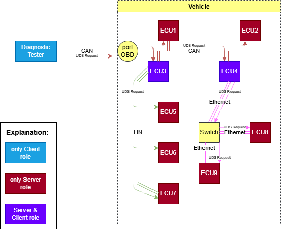

.. _knowledge-base-diagnostic-message:

Diagnostic Message
==================
In this documentation, the terms diagnostic message and UDS message are used interchangeably.
Both refer to messages exchanged between clients and servers during UDS communications.

We distinguish two types of diagnostic messages depending on who is a transmitter:

- `diagnostic request`_ - sent by a client to at least one server
- `diagnostic response`_ - sent by a server to a client

UDS communication is always initiated by a client who sends a `diagnostic request`_ to a network that it has direct
connection with. The client might not be directly connected to the desired recipient(s) of the request, therefore some
servers might be forced to act as gateways and transmit the request to another sub-network(s). Servers' decision
(whether to redirect a message to another sub-network) depends on a target(s) of the request i.e.
server must transmit the request to the sub-network if this is a route (not necessarily a direct one) to at least
one recipient of the message.



  Diagnostic request routing in example vehicle networks.

  In this example all ECUs in the vehicle are the targets of the request - functionally addressed request was sent.

Each server which was the recipient of the request, may decide to send a response back to the nearest client
(the one which previously transmitted the request in this sub-network). Then, the client shall act as a gateway again
and redirect the response back until it reaches the request message originator (Diagnostic Tester).

.. figure:: ../../diagrams/KnowledgeBase-Gateway_response.png
  :alt: Gateway - response
  :figclass: align-center
  :width: 100%

  Diagnostic responses routing in example vehicle networks.

  In this example all ECUs in the vehicle respond to the request.


.. _knowledge-base-request-message:

Diagnostic Request
------------------
Diagnostic request is a `diagnostic message`_ that was transmitted by a client and targets a server or group of servers.
Diagnostic request can be identified by its :ref:`Service Identifier (SID) <knowledge-base-sid>` value.


.. _knowledge-base-response-message:

Diagnostic Response
-------------------
Diagnostic response is a `diagnostic message`_ that was transmitted by a server and targets a client.
Diagnostic response can be identified by its :ref:`Service Identifier (SID) <knowledge-base-sid>` value,
which is usually referred to as :ref:`Response Service Identifier (RSID) <knowledge-base-rsid>`.

UDS defines two formats of diagnostic responses:
 - `positive response message`_
 - `negative response message`_


Positive Response Message
`````````````````````````
If a server responds with a positive response message, it means that the server received the corresponding request
message and executed actions requested by a client.

Format of positive response messages:

+------+------------------+------------+
| Byte | Description      | Value      |
+======+==================+============+
| 1    | Response SID     | SID + 0x40 |
+------+------------------+------------+
| 2    | data-parameter#1 | XX         |
+------+------------------+------------+
| ...  | ...              | ...        |
+------+------------------+------------+
| n    | data-parameter#n | XX         |
+------+------------------+------------+

where:

- SID - :ref:`Service Identifier <knowledge-base-sid>` value that was received in the request message
- XX - any byte value

.. note:: For positive response message this equation is always true:

  .. code-block::

    RSID = SID + 0x40

  where:

  - SID - :ref:`Service Identifier <knowledge-base-sid>` from the request message
  - RSID - :ref:`Response Service Identifier <knowledge-base-rsid>` in the positive response message


Negative Response Message
`````````````````````````
If a server responds with a negative response message, it means that (for some reason) the server could not execute
actions requested by a client.

Format of negative response messages:

+------+-----------------------+-------+
| Byte | Description           | Value |
+======+=======================+=======+
| 1    | Negative Response SID | 0x7F  |
+------+-----------------------+-------+
| 2    | Request SID           | SID   |
+------+-----------------------+-------+
| 3    | NRC                   | XX    |
+------+-----------------------+-------+

where:

- SID - :ref:`Service Identifier <knowledge-base-sid>` value that was received in the request message
- NRC - `Negative Response Code`_ value that identified the reason for negative response


.. _knowledge-base-nrc:

Negative Response Code
----------------------
Negative Response Code (NRC) is one byte value which contains information why a server is not sending
a positive response message.

List of NRC values:

- **0x00 - positiveResponse**: This NRC shall not be used in a negative response message.
  This positiveResponse parameter value is reserved for server internal implementation.

- **0x00-0x0F - ISO Reserved**: This range of values is reserved for future definition by ISO 14229 Standard.

- **0x10 - generalReject**: This NRC indicates that the requested action has been rejected by the server.

- **0x11 - serviceNotSupported**: This NRC indicates that the requested action will not be taken because the
  server does not support the requested service.

- **0x12 - SubFunctionNotSupported**: This NRC indicates that the requested action will not be taken because the
  server does not support the service specific parameters of the request message.

- **0x13 - incorrectMessageLengthOrInvalidFormat**: This NRC indicates that the requested action will not be taken
  because the length of the received request message does not match the prescribed length for the specified service
  or the format of the parameters do not match the prescribed format for the specified service.

- **0x14 - responseTooLong**: This NRC shall be reported by the server if the response to be generated exceeds
  the maximum number of bytes available by the underlying network layer. This could occur if the response message
  exceeds the maximum size allowed by the underlying transport protocol or if the response message exceeds the server
  buffer size allocated for that purpose.

- **0x15-0x20 - ISO Reserved**: This range of values is reserved for future definition by ISO 14229 Standard.

- **0x21 - busyRepeatRequest**: This NRC indicates that the server is temporarily too busy to perform the requested
  operation. In this circumstance the client shall perform repetition of the "identical request message" or
  "another request message". The repetition of the request shall be delayed by a time specified in the respective
  implementation documents.

- **0x22 - conditionsNotCorrect**: This NRC indicates that the requested action will not be taken because the server
  prerequisite conditions are not met.

- **0x23 - ISO Reserved**: This value is reserved for future definition by ISO 14229 Standard.

- **0x24 - requestSequenceError**: This NRC indicates that the requested action will not be taken because the server
  expects a different sequence of request messages or message as sent by the client. This may occur when sequence
  sensitive requests are issued in the wrong order.

- **0x25 - noResponseFromSubnetComponent**: This NRC indicates that the server has received the request but
  the requested action could not be performed by the server as a subnet component which is necessary to supply
  the requested information did not respond within the specified time.

- **0x26 - FailurePreventsExecutionOfRequestedAction**: This NRC indicates that the requested action will not be taken
  because a failure condition, identified by a DTC (with at least one DTC status bit for TestFailed, Pending,
  Confirmed or TestFailedSinceLastClear set to 1), has occurred and that this failure condition prevents the server
  from performing the requested action.

- **0x27-0x30 - ISO Reserved**: This range of values is reserved for future definition by ISO 14229 Standard.

- **0x31 - requestOutOfRange**: This NRC indicates that the requested action will not be taken because the server has
  detected that the request message contains a parameter which attempts to substitute a value beyond its range of
  authority (e.g. attempting to substitute a data byte of 111 when the data is only defined to 100), or which attempts
  to access a DataIdentifier/RoutineIdentifer that is not supported or not supported in active session.

- **0x32 - ISO Reserved**: This value is reserved for future definition by ISO 14229 Standard.

- **0x33 - securityAccessDenied**: This NRC indicates that the requested action will not be taken because the server's
  security strategy has not been satisfied by the client.

- **0x34 - authenticationRequired**: This NRC indicates that the requested service will not be taken because the client
  has insufficient rights based on its Authentication state.

- **0x35 - invalidKey**: This NRC indicates that the server has not given security access because the key sent by
  the client did not match with the key in the server's memory. This counts as an attempt to gain security.

- **0x36 - exceedNumberOfAttempts**: This NRC indicates that the requested action will not be taken because the client
  has unsuccessfully attempted to gain security access more times than the server's security strategy will allow.

- **0x37 - requiredTimeDelayNotExpired**: This NRC indicates that the requested action will not be taken because
  the client's latest attempt to gain security access was initiated before the server's required timeout period had
  elapsed.

- **0x38 - secureDataTransmissionRequired**: This NRC indicates that the requested service will not be taken because
  the requested action is required to be sent using a secured communication channel.

- **0x39 - secureDataTransmissionNotAllowed**: This NRC indicates that this message was received using the
  SecuredDataTransmission (SID 0x84) service. However, the requested action is not allowed to be sent using
  the SecuredDataTransmission (0x84) service.

- **0x3A - secureDataVerificationFailed**: This NRC indicates that the message failed in the security sub-layer.

- **0x3B-0x4F - ISO Reserved**: This range of values is reserved for future definition by ISO 14229 Standard.

- **0x50 - Certificate verification failed, Invalid Time Period**: Date and time of the server does not match
  the validity period of the Certificate.

- **0x51 - Certificate verification failed, Invalid Signature**: Signature of the Certificate could not be verified.

- **0x52 - Certificate verification failed, Invalid Chain of Trust**: Certificate could not be verified against stored
  information about the issuing authority.

- **0x53 - Certificate verification failed, Invalid Type**: Certificate does not match the current requested use case.

- **0x54 - Certificate verification failed, Invalid Format**: Certificate could not be evaluated because the format
  requirement has not been met.

- **0x55 - Certificate verification failed, Invalid Content**: Certificate could not be verified because the content
  does not match.

- **0x56 - Certificate verification failed, Invalid Scope**: The scope of the Certificate does not match the contents
  of the server.

- **0x57 - Certificate verification failed, Invalid Certificate (revoked)**: Certificate received from client
  is invalid, because the server has revoked access for some reason.

- **0x58 - Ownership verification failed**:Delivered Ownership does not match the provided challenge or could not
  verified with the own private key.

- **0x59 - Challenge calculation failed**: The challenge could not be calculated on the server side.

- **0x5A - Setting Access Rights failed**: The server could not set the access rights.

- **0x5B - Session key creation/derivation failed**: The server could not create or derive a session key.

- **0x5C - Configuration data usage failed**: The server could not work with the provided configuration data.

- **0x5D - DeAuthentication failed**:DeAuthentication was not successful, server could still be unprotected.

- **0x5E-0x6F - ISO Reserved**: This range of values is reserved for future definition by ISO 14229 Standard.

- **0x70 - uploadDownloadNotAccepted**: This NRC indicates that an attempt to upload/download to a server's memory
  cannot be accomplished due to some fault conditions.

- **0x71 - transferDataSuspended**: This NRC indicates that a data transfer operation was halted due to some fault.
  The active transferData sequence shall be aborted.

- **0x72 - generalProgrammingFailure**: This NRC indicates that the server detected an error when erasing
  or programming a memory location in the permanent memory device (e.g. Flash Memory).

- **0x73 - wrongBlockSequenceCounter**: This NRC indicates that the server detected an error in the sequence of
  blockSequenceCounter values. Note that the repetition of a TransferData request message with a blockSequenceCounter
  equal to the one included in the previous TransferData request message shall be accepted by the server.

- **0x74-0x77 - ISO Reserved**: This range of values is reserved for future definition by ISO 14229 Standard.

- **0x78 - requestCorrectlyReceived-ResponsePending**: This NRC indicates that the request message was received
  correctly, and that all parameters in the request message were valid (these checks can be delayed until after sending
  this NRC if executing the boot software), but the action to be performed is not yet completed and the server is not
  yet ready to receive another request. As soon as the requested service has been completed, the server shall send
  a positive response message or negative response message with a response code different from this.

- **0x79-0x7D - ISO Reserved**: This range of values is reserved for future definition by ISO 14229 Standard.

- **0x7E - SubFunctionNotSupportedInActiveSession**: This NRC indicates that the requested action will not be taken
  because the server does not support the requested SubFunction in the session currently active. This NRC shall only
  be used when the requested SubFunction is known to be supported in another session, otherwise response code
  SubFunctionNotSupported shall be used.

- **0x7F - serviceNotSupportedInActiveSession**: This NRC indicates that the requested action will not be taken because
  the server does not support the requested service in the session currently active. This NRC shall only be used when
  the requested service is known to be supported in another session, otherwise response code serviceNotSupported
  shall be used.

- **0x80 - ISO Reserved**: This value is reserved for future definition by ISO 14229 Standard.

- **0x81 - rpmTooHigh**: This NRC indicates that the requested action will not be taken because the server prerequisite
  condition for RPM is not met (current RPM is above a preprogrammed maximum threshold).

- **0x82 - rpmTooLow**: This NRC indicates that the requested action will not be taken because the server prerequisite
  condition for RPM is not met (current RPM is below a preprogrammed minimum threshold).

- **0x83 - engineIsRunning**: This NRC is required for those actuator tests which cannot be actuated while the Engine
  is running. This is different from RPM too high negative response, and shall be allowed.

- **0x84 - engineIsNotRunning**: This NRC is required for those actuator tests which cannot be actuated unless
  the Engine is running. This is different from RPM too low negative response, and shall be allowed.

- **0x85 - engineRunTimeTooLow**: This NRC indicates that the requested action will not be taken because the server
  prerequisite condition for engine run time is not met (current engine run time is below a preprogrammed limit).

- **0x86 - temperatureTooHigh**: This NRC indicates that the requested action will not be taken because the server
  prerequisite condition for temperature is not met (current temperature is above a preprogrammed maximum threshold).

- **0x87 - temperatureTooLow**: This NRC indicates that the requested action will not be taken because the server
  prerequisite condition for temperature is not met (current temperature is below a preprogrammed minimum threshold).

- **0x88 - vehicleSpeedTooHigh**: This NRC indicates that the requested action will not be taken because the server
  prerequisite condition for vehicle speed is not met (current VS is above a preprogrammed maximum threshold).

- **0x89 - vehicleSpeedTooLow**: This NRC indicates that the requested action will not be taken because the server
  prerequisite condition for vehicle speed is not met (current VS is below a preprogrammed minimum threshold).

- **0x8A - throttle/PedalTooHigh**: This NRC indicates that the requested action will not be taken because the server
  prerequisite condition for throttle/pedal position is not met (current throttle/pedal position is above
  a preprogrammed maximum threshold).

- **0x8B - throttle/PedalTooLow**: This NRC indicates that the requested action will not be taken because the server
  prerequisite condition for throttle/pedal position is not met (current throttle/pedal position is below
  a preprogrammed minimum threshold).

- **0x8C - transmissionRangeNotInNeutral**: This NRC indicates that the requested action will not be taken because
  the server prerequisite condition for being in neutral is not met (current transmission range is not in neutral).

- **0x8D - transmissionRangeNotInGear**: This NRC indicates that the requested action will not be taken because
  the server prerequisite condition for being in gear is not met (current transmission range is not in gear).

- **0x8E - ISO Reserved**: This value is reserved for future definition by ISO 14229 Standard.

- **0x8F - brakeSwitch(es)NotClosed (Brake Pedal not pressed or not applied)**: This NRC indicates that for safety
  reasons, this is required for certain tests before it begins, and shall be maintained for the entire duration of
  the test.

- **0x90 - shifterLeverNotInPark**: This NRC indicates that for safety reasons, this is required for certain tests
  before it begins, and shall be maintained for the entire duration of the test.

- **0x91 - torqueConverterClutchLocked**: This NRC indicates that the requested action will not be taken because
  the server prerequisite condition for torque converter clutch is not met (current torque converter clutch status
  above a preprogrammed limit or locked).

- **0x92 - voltageTooHigh**: This NRC indicates that the requested action will not be taken because the server
  prerequisite condition for voltage at the primary pin of the server (ECU) is not met (current voltage is above
  a preprogrammed maximum threshold).

- **0x93 - voltageTooLow**: This NRC indicates that the requested action will not be taken because the server
  prerequisite condition for voltage at the primary pin of the server (ECU) is not met (current voltage is below
  a preprogrammed minimum threshold).

- **0x94 - ResourceTemporarilyNotAvailable**: This NRC indicates that the server has received the request but
  the requested action could not be performed by the server because an application which is necessary to supply
  the requested information is temporality not available. This NRC is in general supported by each diagnostic service,
  as not otherwise stated in the data link specific implementation document, therefore it is not listed in the list
  of applicable response codes of the diagnostic services.

- **0x95-0xEF - reservedForSpecificConditionsNotCorrect**: This range of values is reserved for future definition
  condition not correct scenarios by ISO 14229 Standard.

- **0xF0-0xFE - vehicleManufacturerSpecificConditionsNotCorrect**: This range of values is reserved for vehicle
  manufacturer specific condition not correct scenarios.

- **0xFF - ISO Reserved**: This value is reserved for future definition by ISO 14229 Standard.
