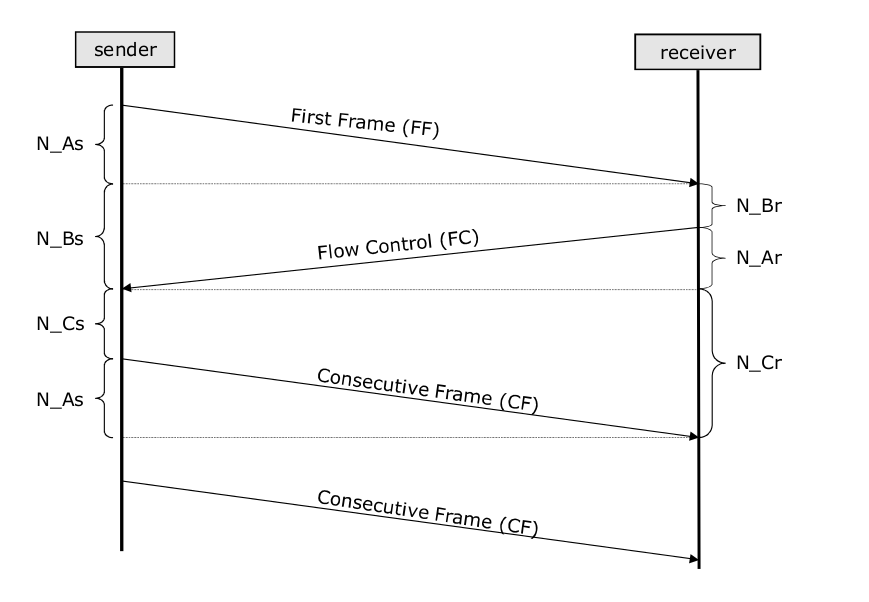

Performance and Error Handling
==============================
In this chapter of the documentation, we would explain performance and timing requirements for UDS communication
and how they are supposed to be handled by UDS entities.


CAN specific
------------
:ref:`ISO standards <knowledge-base-uds-standards>` defines following time values on the network layer of UDS
on CAN communication:

- N_As_
- N_Ar_
- N_Bs_
- N_Br_
- N_Cs_
- N_Cr_



    Network layer time values (N_As, N_Ar, N_Bs, N_Br, N_Cs, N_Cr) present during UDS on CAN communication.

.. note::
  The example uses :ref:`segmented diagnostic message transmission <knowledge-base-segmented-message-transmission>`
  as all CAN timings values can be presented there (all these times are applicable in this case).
  For :ref:`unsegmented diagnostic message transmission <knowledge-base-unsegmented-message-transmission>` though,
  the only applicable time parameter is N_As_.


.. _knowledge-base-can-n-as:

N_As
````
N_As is a time parameter related to transmission of any :ref:`CAN Packet <knowledge-base-uds-can-packet>` by a sender.
It is measured from the beginning of the :ref:`CAN Frame <knowledge-base-can-frame>` (that carries such CAN Packet)
transmission till the reception of a confirmation that this CAN Frame was received by a receiver.

Timeout value:
  1000 ms

Error handling:
  If N_As timeout is exceeded, then the transmission of
  the :ref:`diagnostic message <knowledge-base-diagnostic-message>` shall be aborted.

Affected :ref:`CAN Packets <knowledge-base-uds-can-packet>`:
  - :ref:`Single Frame <knowledge-base-can-single-frame>`
  - :ref:`First Frame <knowledge-base-can-first-frame>`
  - :ref:`Consecutive Frame <knowledge-base-can-consecutive-frame>`


.. _knowledge-base-can-n-ar:

N_Ar
````
N_Ar is a time parameter related to transmission of any :ref:`CAN Packet <knowledge-base-uds-can-packet>` by a receiver.
It is measured from the beginning of the :ref:`CAN Frame <knowledge-base-can-frame>` (that carries such CAN Packet)
transmission till the reception of a confirmation that this CAN Frame was received by a sender.

Timeout value:
  1000 ms

Error handling:
  If N_Ar timeout is exceeded, then the reception of the :ref:`diagnostic message <knowledge-base-diagnostic-message>`
  shall be aborted.

Affected :ref:`CAN Packets <knowledge-base-uds-can-packet>`:
  - :ref:`Flow Control <knowledge-base-can-flow-control>`


.. _knowledge-base-can-n-bs:

N_Bs
````
N_Bs is a time parameter related to :ref:`Flow Control (CAN Packet) <knowledge-base-can-flow-control>` reception
by a sender. It is measured from the end of the last CAN Packet transmission (either transmitted
:ref:`First Frame <knowledge-base-can-first-frame>`, :ref:`Consecutive Frame <knowledge-base-can-consecutive-frame>`
or received :ref:`Flow Control <knowledge-base-can-flow-control>`), till the reception of
:ref:`Flow Control <knowledge-base-can-flow-control>`.

Timeout value:
  1000 ms

Error handling:
  If N_Bs timeout is exceeded, then the reception of the :ref:`diagnostic message <knowledge-base-diagnostic-message>`
  shall be aborted.

Affected :ref:`CAN Packets <knowledge-base-uds-can-packet>`:
  - :ref:`Flow Control <knowledge-base-can-flow-control>`


.. _knowledge-base-can-n-br:

N_Br
````
N_Br is a time parameter related to :ref:`Flow Control (CAN Packet) <knowledge-base-can-flow-control>` transmission
by a receiver. It is measured from the end of the last CAN Packet transmission (either received
:ref:`First Frame <knowledge-base-can-first-frame>`, :ref:`Consecutive Frame <knowledge-base-can-consecutive-frame>`
or transmitted :ref:`Flow Control <knowledge-base-can-flow-control>`), till the start of
:ref:`Flow Control <knowledge-base-can-flow-control>` transmission.

Performance requirement:
  A receiving entity is obliged to transmit :ref:`Flow Control <knowledge-base-can-flow-control>` packet before value
  of N_Br achieves maximal value threshold.

  .. code-block::

    [N_Br] + [N_Ar] < 0.9 * [N_Bs timeout]
    [N_Br max] = 900ms - [N_Ar]

Affected :ref:`CAN Packets <knowledge-base-uds-can-packet>`:
  - :ref:`Flow Control <knowledge-base-can-flow-control>`


.. _knowledge-base-can-n-cs:

N_Cs
````
N_Cs is a time parameter related to :ref:`Consecutive Frame (CAN Packet) <knowledge-base-can-consecutive-frame>`
transmission by a sender. It is measured from the end of the last CAN Packet transmission (either received
:ref:`Flow Control <knowledge-base-can-flow-control>` or transmitted
:ref:`Consecutive Frame <knowledge-base-can-consecutive-frame>`), till the start of
:ref:`Consecutive Frame <knowledge-base-can-consecutive-frame>` transmission.

Performance requirement:
  A sending entity is obliged to transmit :ref:`Consecutive Frame <knowledge-base-can-flow-control>` packet before value
  of N_Cs achieves maximal value threshold.

  .. code-block::

    [N_Cs] + [N_As] < 0.9 * [N_Cr timeout]
    [N_Cs max] = 900ms - [N_As]

Affected :ref:`CAN Packets <knowledge-base-uds-can-packet>`:
  - :ref:`Consecutive Frame <knowledge-base-can-consecutive-frame>`


.. _knowledge-base-can-n-cr:

N_Cr
````
N_Cr is a time parameter related to :ref:`Consecutive Frame (CAN Packet) <knowledge-base-can-consecutive-frame>`
reception by a receiver. It is measured from the end of the last CAN Packet transmission (either transmitted
:ref:`Flow Control <knowledge-base-can-flow-control>` or received
:ref:`Consecutive Frame <knowledge-base-can-consecutive-frame>`), till the reception of
:ref:`Consecutive Frame <knowledge-base-can-consecutive-frame>`.

Timeout value:
  1000 ms

Error handling:
  If N_Cr timeout is exceeded, then the reception of the :ref:`diagnostic message <knowledge-base-diagnostic-message>`
  shall be aborted.

Affected :ref:`CAN Packets <knowledge-base-uds-can-packet>`:
  - :ref:`Consecutive Frame <knowledge-base-can-consecutive-frame>`
