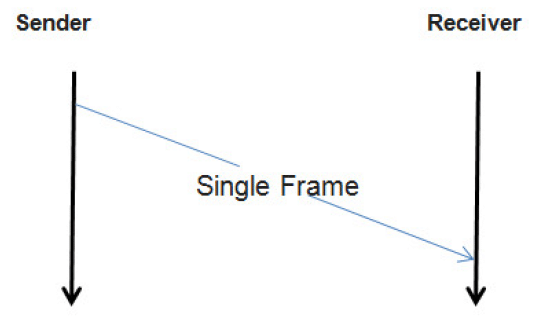
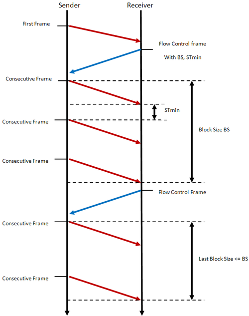

.. _knowledge-base-segmentation:

Segmentation
============


.. _knowledge-base-message-segmentation:

Message Segmentation
--------------------
To transmit a diagnostic message, its information (payload and addressing) must be unambiguously encoded into one
or more segments (these segments are called :ref:`UDS Packets <knowledge-base-uds-packet>` by this documentation)
that are specific for bus used.

.. note:: Segmentation process is specific for each bus due to various topologies supported by each bus,
    various communication models (e.g. Master/Slave) enforced by them, etc.


Segmentation on CAN
```````````````````


Unsegmented message transmission
''''''''''''''''''''''''''''''''
When mentioning unsegmented message transmission, we mean a case when an entire
:ref:`Diagnostic Message <knowledge-base-diagnostic-message>` can be fully transmitted by a single packet.
:ref:`Single Frame (CAN Packet) <knowledge-base-can-single-frame>` is the only type of CAN Packets that can be used in
the described scenario.



    Transmission of an unsegmented Diagnostic Message on CAN bus.

    A sender transmits a :ref:`Single Frame (CAN Packet) <knowledge-base-can-single-frame>` that contains
    an entire :ref:`Diagnostic Message <knowledge-base-diagnostic-message>`.


Segmented message transmission
''''''''''''''''''''''''''''''
When a :ref:`Diagnostic Message <knowledge-base-diagnostic-message>` to be transmitted on CAN contains payload which
size is greater than a :ref:`Single Frame <knowledge-base-can-single-frame>` capacity, then the message payload
must be divided and transmitted by many CAN packets. The first packet to carry such messages is
:ref:`First Frame (CAN Packet) <knowledge-base-can-first-frame>` and its transmission is followed by
:ref:`Consecutive Frames (CAN Packets) <knowledge-base-can-consecutive-frame>`.
A receiver controls the stream of incoming :ref:`Consecutive Frames <knowledge-base-can-consecutive-frame>` by sending
:ref:`Flow Control (CAN Packet) <knowledge-base-can-flow-control>` after
:ref:`First Frame <knowledge-base-can-first-frame>` and each complete transmission of
:ref:`Consecutive Frames <knowledge-base-can-consecutive-frame>` block.

.. note:: The size of :ref:`Consecutive Frames <knowledge-base-can-consecutive-frame>` block is determined by
    :ref:`Block Size <knowledge-base-can-block-size>` parameter which value is carried by
    :ref:`Flow Control <knowledge-base-can-flow-control>`.

.. note:: The minimum time between two :ref:`Consecutive Frames <knowledge-base-can-consecutive-frame>` is determined by
    :ref:`Separation Time Minimum <knowledge-base-can-st-min>` parameter which value is carried by
    :ref:`Flow Control <knowledge-base-can-flow-control>`.




    Transmission of a segmented Diagnostic Message on CAN bus.

    A sender initiates :ref:`Diagnostic Message <knowledge-base-diagnostic-message>` transmission with
    a :ref:`First Frame (CAN Packet) <knowledge-base-can-first-frame>`
    Then, a receiver controls the stream of incoming :ref:`Consecutive Frames (CAN Packets) <knowledge-base-can-consecutive-frame>`
    by transmitting :ref:`Flow Controls (CAN Packets) <knowledge-base-can-flow-control>`.

.. seealso:: Only the typical use case of :ref:`Flow Control <knowledge-base-can-flow-control>` was described here.
    Check :ref:`Flow Status <knowledge-base-can-flow-status>` parameter and meaning of its values to study less likely
    scenarios.


.. _knowledge-base-packets-desegmentation:

Packets Desegmentation
----------------------
Desegmentation is an unambiguous operation which is the reverse process to a `message segmentation`_.
It transforms one or more :ref:`UDS packets <knowledge-base-uds-packet>` into
a :ref:`diagnostic message <knowledge-base-diagnostic-message>`.

.. note:: There are many ways to segment a diagnostic message into CAN packets, but there is always only one correct way
    to perform desegmentation and decode a diagnostic message out of CAN Packets.
